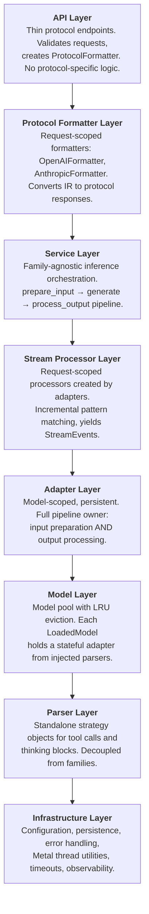

# MLX Server — Architecture Blueprint

This document defines the target architecture of the `mlx_server` component: an
embedded inference server providing OpenAI and Anthropic-compatible APIs for MLX
models on Apple Silicon. It is the authoritative reference for how the component
**should** work. Deviations from this document are tracked separately as
compliance issues.

---

## Overview: 3-Layer Adapter Pipeline

The mlx_server uses a **3-layer pipeline architecture** that cleanly separates
concerns and enables parallel request handling with zero per-request detection:

### Layer 1: ModelAdapter (Model-Scoped, Persistent)
- **Lifecycle**: Created once at model load time, destroyed at eviction
- **Scope**: One adapter per loaded model, shared across all requests to that model
- **Responsibility**: Full pipeline owner for BOTH input and output
  - **INPUT**: Message conversion, chat template, tool delivery, stop tokens
  - **OUTPUT**: Tool extraction, thinking extraction, response cleaning
- **Key Methods**:
  - `prepare_input(messages, tools, ...) → PreparedInput`
  - `create_stream_processor() → StreamProcessor` (factory)
  - `process_complete(raw_output) → AdapterResult`
- **Pre-computed**: Stop tokens, stream markers (computed at `__init__`, cached)
- **Composed**: Injected with ToolCallParser + ThinkingParser

### Layer 2: StreamProcessor (Request-Scoped)
- **Lifecycle**: Created per streaming request via `adapter.create_stream_processor()`
- **Scope**: One processor per stream, owned by that request
- **Responsibility**: Incremental pattern matching, per-request state
  - Yields protocol-neutral `StreamEvent` (IR) for each token
  - Buffers potential pattern matches across token boundaries
  - Tracks mode (content / thinking / tool)
  - Finalizes with complete extraction via adapter's parsers
- **Key Methods**:
  - `feed(token) → StreamEvent` (incremental)
  - `finalize() → AdapterResult` (complete extraction)

### Layer 3: ProtocolFormatter (Request-Scoped)
- **Lifecycle**: Created once per request by the endpoint handler
- **Scope**: One formatter per request, determined by endpoint
- **Responsibility**: Convert protocol-neutral IR to protocol responses, and parse
  protocol-specific requests into IR
  - `parse_request(request) → InternalRequest` (static — parses incoming request)
  - `StreamEvent` → protocol-specific SSE chunks
  - `TextResult` → protocol-specific complete responses
  - OpenAIFormatter: parses `ChatCompletionRequest`, formats IR → OpenAI responses
  - AnthropicFormatter: parses `AnthropicMessagesRequest`, formats IR → Anthropic responses
- **Key Methods**:
  - `parse_request(request) → InternalRequest` (abstract staticmethod)
  - `stream_start() → list[dict]`
  - `stream_event(StreamEvent) → list[dict]`
  - `stream_end(finish_reason, tool_calls, output_tokens) → list[dict]`
  - `format_complete(TextResult, prompt_tokens, completion_tokens) → Any`

### Request Flow

```
[Endpoint] → Formatter.parse_request(request) → InternalRequest (IR)
    ↓
[BackendRouter.route_request(ir)] → RoutingOutcome   (if cloud routing enabled)
    │
    ├── Cloud route: forward to cloud backend → raw_response / raw_stream
    │                                          (or ir_result / ir_stream if cross-protocol)
    │
    └── Local route: → InferenceService (generate_chat_stream / generate_chat_complete_response)
            ↓
        [Adapter.prepare_input()] → PreparedInput
            ↓
        [Metal Thread] → raw token stream
            ↓
        [StreamProcessor.feed()] → StreamEvent (IR)
            ↓
        [ProtocolFormatter.stream_event()] → SSE chunk → client
            ↓ (on stream end)
        [StreamProcessor finalize via adapter.process_complete()] → TextResult (IR)
            ↓
        [ProtocolFormatter.stream_end()] → final chunks → client
```

### Key Design Principles
1. **1 model + 1 adapter**: Configured at load time, reused across all requests
2. **Request-scoped sessions**: Each request gets own StreamProcessor + ProtocolFormatter
3. **Parallel request support**: Queued behind same model+adapter combo, each with own processor+formatter
4. **Zero-copy streaming**: Events flow through pipeline without buffering/duplication
5. **Model-type agnostic server**: Service orchestrates; adapters handle model-specific logic
6. **Vision = Text + multimodal input**: Vision models use text adapters with image preprocessing

---

## 1. Principles

1. **Single inference pipeline**: All protocols (OpenAI, Anthropic, frontend UI)
   converge into one service layer. There is no per-endpoint inference logic.
2. **Composable, stateful adapters**: Each loaded model has a dedicated adapter
   instance composed from reusable parsers. The adapter is created at load time
   and lives as long as the model is in the pool. No per-request detection.
3. **No data loss through layers**: Messages, including tool calls, tool results,
   and multimodal content, pass through every layer with full fidelity.
4. **One canonical type per concept**: Each domain concept (tool call, message,
   model type) has exactly one Pydantic model. No duplicates, no bridging.
5. **Shared infrastructure**: Cross-cutting concerns like Metal thread management
   and memory cleanup are factored into reusable utilities, not duplicated.
6. **Probe-first, detect-as-fallback**: Model capabilities are determined once
   during probing and stored in the database. Runtime detection is a fallback
   for unprobed models, not the primary path.
7. **Parser reuse across families**: Parsers (tool call, thinking) are standalone
   strategy objects decoupled from model families. The same parser can serve
   multiple families; different models within a family can use different parsers.

---

## 2. Component Map

```
mlx_server/
  main.py                 # FastAPI app factory, lifespan, health check
  config.py               # MLXServerSettings (env: MLX_SERVER_*)
  database.py             # SQLite engine for audit logs

  api/v1/                 # Protocol endpoints (thin — validate, dispatch, format)
    chat.py               # POST /v1/chat/completions (OpenAI)
    completions.py        # POST /v1/completions (OpenAI legacy)
    messages.py           # POST /v1/messages (Anthropic)
    embeddings.py         # POST /v1/embeddings
    speech.py             # POST /v1/audio/speech (TTS)
    transcriptions.py     # POST /v1/audio/transcriptions (STT)
    models.py             # GET /v1/models
    admin.py              # Pool status, preload, unload, audit

  schemas/                # One canonical Pydantic model per concept
    openai.py             # OpenAI request/response types
    anthropic.py          # Anthropic request/response types

  parsers/                # Standalone, reusable extraction strategies
    base.py               # ToolCallParser (ABC), ThinkingParser (ABC)
    tool_call.py          # Concrete tool call parsers
    thinking.py           # Concrete thinking/reasoning parsers
    registry.py           # Parser registry: string ID → parser class

  models/                 # Model lifecycle and unified adapter architecture
    types.py              # ModelType enum (TEXT_GEN, VISION, EMBEDDINGS, AUDIO)
    ir.py                 # IR types: PreparedInput, StreamEvent, TextResult, EmbeddingResult,
                          #   AudioResult, TranscriptionResult, InternalRequest,
                          #   InferenceResult, RoutingOutcome
    detection.py          # detect_model_type(), detect_model_family() — fallback
    pool.py               # ModelPoolManager — LRU cache, adapter-aware loading
    adapters/
      composable.py       # ModelAdapter (single concrete class for all model types)
      configs.py          # FamilyConfig (Pydantic BaseModel) + FAMILY_CONFIGS registry
      strategies.py       # Strategy functions (template, tool format, message conversion)
      registry.py         # Adapter factory: create_adapter(), detect_model_family()

  services/               # Inference orchestration (delegates to adapter pipeline)
    inference.py          # Public: generate_chat_stream(), generate_chat_complete_response(),
                          #   generate_completion() (legacy); generate_chat_completion() DELETED
    embeddings.py         # Thin wrapper: calls adapter.generate_embeddings()
    audio.py              # Thin wrapper: calls adapter.generate_speech() / adapter.transcribe()
    formatters/           # Protocol-specific response formatters (also parse requests)
      base.py             # ProtocolFormatter (ABC) — includes parse_request() abstract staticmethod
      openai.py           # OpenAIFormatter: parse_request() + IR → OpenAI responses
      anthropic.py        # AnthropicFormatter: parse_request() + IR → Anthropic responses
    structured_output.py  # JSON schema validation for responses
    image_processor.py    # Image URL fetching + resizing for vision
    audit.py              # Request tracking + logging
    cloud/                # IR-based cloud routing layer
      router.py           # BackendRouter: route_request(ir) → RoutingOutcome; get_router() singleton
      client.py           # CloudBackendClient (ABC): forward_request(ir) → RoutingOutcome;
                          #   protocol property; AsyncCircuitBreaker
      openai.py           # OpenAICloudBackend: same-protocol passthrough + cross-protocol conversion
      anthropic.py        # AnthropicCloudBackend: same-protocol passthrough + cross-protocol conversion
    batching/             # Continuous batching (experimental)

  errors/                 # RFC 7807 error handling
  middleware/             # Per-endpoint timeouts
  observability/          # LogFire instrumentation
  utils/                  # Shared utilities (Metal thread runner, memory)
  benchmark/              # Token throughput benchmarks
```

---

## 3. Layered Architecture



**Layer rules:**
- Each layer communicates only with adjacent layers.
- The API layer never imports from `models/adapters/` or `parsers/`.
- The service layer accesses adapters only through `LoadedModel.adapter`.
- StreamProcessor is created by adapters, used by services.
- ProtocolFormatters consume IR only, never call adapters or services directly.
- Parsers are injected into adapters; they never call adapters or services.
- Adapters never call services or API endpoints.

---

## 4. Request Flow — 3-Layer Pipeline

### 4.1 Streaming Pipeline (All Text + Vision Models)

```
POST /v1/chat/completions (OpenAI)             POST /v1/messages (Anthropic)
    │                                               │
    ▼                                               ▼
api/v1/chat.py                                 api/v1/messages.py
    │                                               │
    ├── Validate against schema                     ├── Validate against schema
    ├── OpenAIFormatter.parse_request(request)      ├── AnthropicFormatter.parse_request(request)
    │   → InternalRequest (IR)                      │   → InternalRequest (IR)
    │     (original_request + original_protocol     │     (original_request + original_protocol
    │      attached for passthrough optimization)   │      attached for passthrough optimization)
    │                                               │
    │   [if enable_cloud_routing]                   │   [if enable_cloud_routing]
    │   → BackendRouter.route_request(ir)           │   → BackendRouter.route_request(ir)
    │     → RoutingOutcome (see Section 17)         │     → RoutingOutcome (see Section 17)
    │                                               │
    └──────────────────┬────────────────────────────┘
                       │  (local/direct inference path)
                       │  ir.model, ir.messages, ir.params,
                       │  ir.stop, ir.tools, ir.images
                       ▼
              services/inference.py
              ::generate_chat_stream()
                       │
                       ├── pool.get_model()         → LoadedModel (with adapter)
                       │
                       │   LAYER 1: ModelAdapter (model-scoped, persistent)
                       │  ┌─────────────────────────────────────────────┐
                       │  │  Created once at model load time            │
                       │  │  Pre-configured with family parsers         │
                       │  │  Owns BOTH input prep AND output processing │
                       │  └─────────────────────────────────────────────┘
                       │
                       ├── adapter.prepare_input(messages, tools, ...)
                       │   │
                       │   ├── convert_messages() — handle tool roles
                       │   ├── apply_chat_template() — messages → prompt
                       │   ├── format_tools() — native or injected
                       │   └── aggregate stop_tokens (pre-computed)
                       │   │
                       │   ▼  PreparedInput(prompt, stop_tokens, ...)
                       │
                       ▼  prompt string + stop tokens
              Metal Thread (adapter.generate_step / stream_generate)
                       │
                       ▼  raw token stream
                       │
                       │   LAYER 2: StreamProcessor (request-scoped)
                       │  ┌─────────────────────────────────────────────┐
                       │  │  Created per-request via adapter factory    │
                       │  │  Holds per-request state: buffers, mode     │
                       │  │  Incremental pattern matching               │
                       │  └─────────────────────────────────────────────┘
                       │
                       ├── stream_processor = adapter.create_stream_processor()
                       │
                       ├── For each token:
                       │   │
                       │   ├── stream_processor.feed(token) → StreamEvent (IR)
                       │   │   │
                       │   │   ├── Match thinking tags → reasoning_content
                       │   │   ├── Match tool markers → buffer for extraction
                       │   │   └── Regular text → content
                       │   │   │
                       │   │   ▼  StreamEvent (protocol-neutral)
                       │   │
                       │   │   LAYER 3: ProtocolFormatter (request-scoped)
                       │   │  ┌─────────────────────────────────────────┐
                       │   │  │  Determined by endpoint                 │
                       │   │  │  Converts IR → protocol-specific SSE    │
                       │   │  │  OpenAIFormatter / AnthropicFormatter   │
                       │   │  └─────────────────────────────────────────┘
                       │   │
                       │   └── formatter.stream_event(event) → list[SSE chunk]
                       │       │
                       │       ▼  yield to client
                       │
                       ├── On stream end (final TextResult from generator):
                       │   │
                       │   └── formatter.stream_end(finish_reason, tool_calls, output_tokens)
                       │       │                    → final SSE chunks
                       │       ▼  yield to client
```

**Key Design Points:**
- **Vision models use TEXT adapters** — Vision is TEXT_GEN + multimodal input
- **Same output pipeline** — Vision models produce TextResult, support tools/thinking
- **Zero protocol logic in service** — Service returns IR; formatters handle protocol details
- **IR created at endpoint entry** — `Formatter.parse_request()` runs before routing,
  attaching `original_request` and `original_protocol` for cloud passthrough optimization

### 4.2 Non-Streaming Pipeline

```
[Endpoint: parse_request(request) → InternalRequest]
    ↓
[BackendRouter.route_request(ir) → RoutingOutcome]   (if cloud routing enabled)
    │
    ├── Cloud (same-protocol): raw_response forwarded directly → protocol response
    │
    ├── Cloud (cross-protocol): ir_result → formatter.format_complete() → protocol response
    │
    └── Local: generate_chat_complete_response(ir fields...) → InferenceResult
            ↓
        [adapter.prepare_input(messages, tools)] → PreparedInput
            ↓
        [adapter.generate(prepared_input)] → TextResult (Metal thread)
            ↓  (or legacy: stream_generate → adapter.process_complete())
        [InferenceResult(result=TextResult, prompt_tokens, completion_tokens)]
            ↓
        [formatter.format_complete(result, prompt_tokens, completion_tokens)]
            ↓
        complete protocol response
```

### 4.3 Embeddings Pipeline

```
POST /v1/embeddings
    │
    ▼
api/v1/embeddings.py::create_embeddings()
    │
    ├── detect_model_type() → EMBEDDINGS
    │
    ▼
services/embeddings.py::generate_embeddings()
    │
    ├── pool.get_model() (EMBEDDINGS type → mlx-embeddings)
    │   │
    │   └── LoadedModel with minimal adapter (NullToolParser, NullThinkingParser)
    │
    ├── adapter.prepare_input(texts=texts) → tokenized batch
    ├── model.embed() (Metal thread via adapter.generate_embeddings())
    ├── adapter.process_complete(embeddings) → EmbeddingResult (IR)
    │   │
    │   └── Extract embeddings, normalize, compute dimensions + total_tokens
    │
    └── return EmbeddingResult (IR)
    │
    ▼  (back in endpoint)
api/v1/embeddings.py builds EmbeddingResponse directly from EmbeddingResult
    (no ProtocolFormatter — embeddings use a direct schema build)
```

### 4.4 Audio Pipeline

```
POST /v1/audio/speech        → api/v1/speech.py::create_speech()
POST /v1/audio/transcriptions → api/v1/transcriptions.py::create_transcription()
    │
    ▼
services/audio.py::generate_speech() / transcribe_audio()
    │
    ├── pool.get_model() (AUDIO type → mlx-audio)
    │   │
    │   └── WhisperAdapter or KokoroAdapter
    │
    ├── TTS: adapter.prepare_input(text_for_tts=text) → audio_params
    │   │
    │   ├── adapter.generate_speech() (Metal thread)
    │   └── return AudioResult(audio_bytes, sample_rate, format)
    │
    ├── STT: adapter.prepare_input(audio_data=audio_bytes) → audio_tensor
    │   │
    │   ├── adapter.transcribe() (Metal thread)
    │   └── return TranscriptionResult(text, segments, language)
    │
    └── return AudioResult / TranscriptionResult (IR)
    │
    ▼  (back in endpoint)
api/v1/speech.py returns Response(content=result.audio_bytes, media_type=...)
api/v1/transcriptions.py builds TranscriptionResponse from TranscriptionResult
    (no ProtocolFormatter — audio endpoints use direct response construction)
```

---

## 5. Parser Architecture

Parsers are standalone strategy objects that handle extraction of structured
content from model output. They are decoupled from model families and reusable:
the same parser can serve multiple families, and different models within a family
can use different parsers.

### 5.1 Parser Contracts

```python
class ToolCallParser(ABC):
    """Extracts tool calls from model output.

    Each implementation handles one specific output format.
    Used in both streaming (marker detection) and batch (full extraction).
    """

    @property
    @abstractmethod
    def parser_id(self) -> str:
        """Unique string identifier for DB storage (e.g., 'hermes_json')."""

    @property
    @abstractmethod
    def stream_markers(self) -> list[tuple[str, str]]:
        """(start_marker, end_marker) pairs for streaming detection."""

    @abstractmethod
    def extract(self, text: str) -> list[ToolCall]:
        """Extract all tool calls from complete text (batch mode)."""

    def validates(self, text: str, expected_fn: str) -> bool:
        """Check if output contains a valid call to expected_fn.
        Used by probe. Delegates to extract() — same code path as inference."""
        return any(tc.function.name == expected_fn for tc in self.extract(text))


class ThinkingParser(ABC):
    """Extracts thinking/reasoning blocks from model output.

    The enable_thinking parameter is part of the base contract because
    some models (GLM-4.7, Qwen3) support toggling thinking mode per-request
    via the chat template, while others always think or never think.
    """

    @property
    @abstractmethod
    def parser_id(self) -> str:
        """Unique string identifier for DB storage (e.g., 'think_tag')."""

    @property
    @abstractmethod
    def stream_markers(self) -> list[tuple[str, str]]:
        """(start_marker, end_marker) pairs for streaming detection."""

    @property
    def supports_toggle(self) -> bool:
        """Whether this parser supports enable_thinking parameter in templates.
        Override in subclasses for models that support toggling."""
        return False

    @abstractmethod
    def extract(self, text: str) -> str | None:
        """Extract thinking content from text. Returns None if no thinking."""

    @abstractmethod
    def remove(self, text: str) -> str:
        """Remove all thinking blocks from text, return cleaned content."""
```

### 5.2 Concrete Parsers

**Tool Call Parsers** (many-to-many with families):

| Parser ID          | Format                                                           | Used By (defaults)     |
|--------------------|------------------------------------------------------------------|------------------------|
| `hermes_json`      | `<tool_call>{"name": ..., "arguments": ...}</tool_call>`         | Qwen, Qwen3           |
| `glm4_native`      | `<tool_call>fn<arg_key>k</arg_key><arg_value>v</arg_value>`     | GLM-4.7                |
| `glm4_xml`         | `<tool_call><name>fn</name><arguments>{...}</arguments>`         | GLM-4                  |
| `llama_xml`        | `<function=name>{...}</function>`                                | Llama 3.x              |
| `llama_python`     | `<\|python_tag\|>module.method(args)<\|eom_id\|>`               | Llama (code)           |
| `null`             | No-op, never matches                                             | Gemma, Mistral, others |

**Thinking Parsers**:

| Parser ID      | Format                          | `supports_toggle` | Used By (defaults)    |
|----------------|---------------------------------|-------------------|-----------------------|
| `think_tag`    | `<think>...</think>`            | `True`            | Qwen3, GLM-4.7       |
| `null`         | No-op, no thinking blocks       | `False`           | Gemma, Mistral, Llama |

### 5.3 Parser Registry

A simple registry maps string IDs to parser classes:

```python
TOOL_PARSERS: dict[str, type[ToolCallParser]] = {
    "hermes_json": HermesJsonParser,
    "glm4_native": Glm4NativeParser,
    "glm4_xml":    Glm4XmlParser,
    "llama_xml":   LlamaXmlParser,
    "llama_python": LlamaPythonParser,
    "null":        NullToolParser,
}

THINKING_PARSERS: dict[str, type[ThinkingParser]] = {
    "think_tag": ThinkTagParser,
    "null":      NullThinkingParser,
}
```

When loading a model from DB, parser IDs are resolved to instances:
`"hermes_json"` → `HermesJsonParser()`. This decouples DB storage from Python
classes and makes the system extensible without schema migrations.

---

## 6. Adapter Architecture — Unified Adapter with Config-Driven Behavior

### 6.1 Layer 1: ModelAdapter (Model-Scoped, Persistent)

Each `LoadedModel` holds a dedicated `ModelAdapter` instance. The adapter is
**created once at model load time** and **destroyed when the model is evicted**.
It is the **full pipeline owner**: both INPUT preparation and OUTPUT processing
**for all model types** (TEXT_GEN, VISION, EMBEDDINGS, AUDIO).

The **Unified Adapter Architecture** replaced 12 family-specific subclasses with
a single concrete `ModelAdapter` class configured from `FamilyConfig` data objects.
This eliminates subclass proliferation and consolidates family-specific behavior
into composable strategy functions.

```python
class ModelAdapter:
    """Unified adapter for all model families and types.

    Owns the complete inference pipeline for ALL model types:
    - TEXT_GEN / VISION: Message conversion, chat template, tool delivery, streaming
    - EMBEDDINGS: Tokenization, normalization
    - AUDIO: Audio preprocessing, TTS/STT parameter setup

    Configured from FamilyConfig at creation time. Delegates family-specific
    behavior to strategy functions. Lives as long as the model is in pool.
    """

    def __init__(
        self,
        config: FamilyConfig | None = None,
        tokenizer: Any | None = None,
        tool_parser: ToolCallParser | None = None,
        thinking_parser: ThinkingParser | None = None,
        model_id: str | None = None,
        # Profile settings (configured once at load time, used at request time)
        system_prompt: str | None = None,
        enable_tool_injection: bool = False,
        template_options: dict[str, Any] | None = None,
    ):
        self.tokenizer = tokenizer
        self.config = config
        self.model_id = model_id

        # Create parsers from config factories (or use injected instances)
        self.tool_parser = tool_parser or (config.tool_parser_factory() if config else NullToolParser())
        self.thinking_parser = thinking_parser or (config.thinking_parser_factory() if config else NullThinkingParser())

        # Pre-compute stop tokens and stream markers
        self._stop_token_ids: list[int] = self._compute_stop_tokens()
        self._stream_markers: list[tuple[str, str]] = self._compute_stream_markers()

        # Profile settings — stored once, used at every request
        self._system_prompt = system_prompt
        self._enable_tool_injection = enable_tool_injection
        self._template_options = template_options

    # --- Identity ---

    @property
    def family(self) -> str:
        """Model family identifier from config."""
        return self.config.family

    # --- Configuration ---

    def configure(
        self,
        system_prompt: str | None = None,
        enable_tool_injection: bool | None = None,
        template_options: dict[str, Any] | None = None,
    ) -> None:
        """Reconfigure adapter settings (e.g., for probe or Profile changes).
        Only updates fields that are explicitly provided (not None)."""
        if system_prompt is not None:
            self._system_prompt = system_prompt
        if enable_tool_injection is not None:
            self._enable_tool_injection = enable_tool_injection
        if template_options is not None:
            self._template_options = template_options

    # --- Idempotent System Prompt ---

    def _ensure_system_prompt(self, messages: list[dict]) -> list[dict]:
        """Inject Profile's default system prompt if not already present.
        Idempotent: if messages[0] is already a system message, pass through."""
        if not self._system_prompt:
            return messages
        if messages and messages[0].get("role") == "system":
            return messages
        return [{"role": "system", "content": self._system_prompt}, *messages]

    # --- INPUT PIPELINE (all model types) ---

    def prepare_input(
        self,
        messages: list[dict] | None = None,
        *,
        tools: list[dict] | None = None,
        enable_thinking: bool | None = None,
        images: list[Any] | None = None,
        texts: list[str] | None = None,      # Embeddings
        audio_data: bytes | None = None,      # Audio STT
        text_for_tts: str | None = None,      # Audio TTS
        **kwargs,
    ) -> PreparedInput:
        """Full input preparation pipeline for all model types.

        All configuration (system_prompt, enable_tool_injection, template_options)
        is read from the adapter's stored Profile settings, not from parameters.
        """
        # Dispatch based on model type (via strategy pattern)
        if self.config.model_type in (ModelType.TEXT_GEN, ModelType.VISION):
            return self._prepare_text_input(messages, tools, enable_thinking, **kwargs)
        elif self.config.model_type == ModelType.EMBEDDINGS:
            return self._prepare_embedding_input(texts, **kwargs)
        elif self.config.model_type == ModelType.AUDIO:
            return self._prepare_audio_input(audio_data, text_for_tts, **kwargs)

    def _prepare_text_input(self, messages, tools, enable_thinking, **kwargs):
        """TEXT_GEN / VISION input preparation."""
        # 1. Inject default system prompt if not already present
        messages = self._ensure_system_prompt(messages)

        # 2. Message conversion (handle tool roles) via config strategy
        converted = self.config.message_convert_strategy(messages) if self.config.message_convert_strategy else messages

        # 3. Tool handling uses adapter config, not runtime flags
        use_tools = tools and (self.supports_tool_calling() or self._enable_tool_injection)
        effective_tools = tools if use_tools else None

        # 4. Apply chat template via config strategy (uses stored template_options)
        prompt = self.apply_chat_template(
            messages=converted,
            add_generation_prompt=True,
            tools=effective_tools,
        )

        # 5. Vision: preprocess images
        pixel_values = None
        if kwargs.get("images"):
            pixel_values = self._preprocess_images(kwargs["images"])

        return PreparedInput(
            prompt=prompt,
            stop_token_ids=self._stop_token_ids,
            pixel_values=pixel_values,
            metadata={},
        )

    # --- OUTPUT PIPELINE (all model types) ---

    def generate(self, prepared_input: PreparedInput, **kwargs) -> str | list[float] | bytes:
        """Execute generation for this model type.

        Delegates to appropriate library:
        - TEXT_GEN: mlx-lm generate
        - VISION: mlx-vlm generate (with pixel_values)
        - EMBEDDINGS: mlx-embeddings encode
        - AUDIO: mlx-audio synthesize/transcribe
        """
        if self.config.model_type == ModelType.TEXT_GEN:
            return self._generate_text(prepared_input, **kwargs)
        elif self.config.model_type == ModelType.VISION:
            return self._generate_vision(prepared_input, **kwargs)
        elif self.config.model_type == ModelType.EMBEDDINGS:
            return self._generate_embeddings(prepared_input, **kwargs)
        elif self.config.model_type == ModelType.AUDIO:
            return self._generate_audio(prepared_input, **kwargs)

    def generate_step(self, prepared_input: PreparedInput, **kwargs) -> Iterator[str]:
        """Streaming generation for text/vision models."""
        # Only TEXT_GEN and VISION support streaming
        if self.config.model_type in (ModelType.TEXT_GEN, ModelType.VISION):
            return self._generate_text_stream(prepared_input, **kwargs)
        else:
            raise ValueError(f"Streaming not supported for {self.config.model_type}")

    def create_stream_processor(self) -> StreamProcessor:
        """Factory method for request-scoped stream processor."""
        return StreamProcessor(
            tool_parser=self.tool_parser,
            thinking_parser=self.thinking_parser,
            stream_markers=self._stream_markers,
        )

    def process_complete(self, raw_output: str | list[float] | bytes, **kwargs) -> AdapterResult:
        """Process complete output for all model types.

        Dispatches to appropriate result type:
        - TEXT_GEN/VISION: TextResult with tool/thinking extraction
        - EMBEDDINGS: EmbeddingResult with normalization
        - AUDIO: AudioResult or TranscriptionResult
        """
        if self.config.model_type in (ModelType.TEXT_GEN, ModelType.VISION):
            return self._process_text_output(raw_output, **kwargs)
        elif self.config.model_type == ModelType.EMBEDDINGS:
            return self._process_embedding_output(raw_output, **kwargs)
        elif self.config.model_type == ModelType.AUDIO:
            return self._process_audio_output(raw_output, **kwargs)

    def _process_text_output(self, raw_output: str, **kwargs) -> TextResult:
        """Extract tools, thinking, clean content."""
        tool_calls = self.tool_parser.extract(raw_output)
        reasoning_content = self.thinking_parser.extract(raw_output)
        content = self.thinking_parser.remove(raw_output)

        return TextResult(
            content=content,
            reasoning_content=reasoning_content,
            tool_calls=tool_calls,
            finish_reason="stop",
            prompt_tokens=kwargs.get("prompt_tokens", 0),
            completion_tokens=kwargs.get("completion_tokens", 0),
        )

    # --- Pre-Computed Properties ---

    def get_stop_tokens(self) -> list[int]:
        """Return pre-computed stop tokens from config."""
        return self._stop_token_ids

    def _compute_stop_tokens(self) -> list[int]:
        """Compute stop tokens once at init from config."""
        # Base stop tokens from tokenizer
        stop_ids = []
        if hasattr(self.tokenizer, "eos_token_id") and self.tokenizer.eos_token_id:
            stop_ids.append(self.tokenizer.eos_token_id)

        # Family-specific stop tokens from config
        for token in self.config.stop_tokens:
            if token_id := self.tokenizer.convert_tokens_to_ids(token):
                stop_ids.append(token_id)

        return stop_ids

    def _compute_stream_markers(self) -> list[tuple[str, str]]:
        """Combined markers from both parsers for single-pass streaming."""
        return (
            self.tool_parser.stream_markers
            + self.thinking_parser.stream_markers
        )
```

**Vision Models Use Text Config:**

Vision models are configured with the **same family configs** as text models
(qwen, gemma, etc.). The only difference is `model_type=VISION` in the config,
which enables image preprocessing in `prepare_input()`. They share the same
output pipeline (tool parsing, thinking extraction) as text models.

```python
# Vision model loading (in pool.py)
config = FAMILY_CONFIGS.get(family, FAMILY_CONFIGS["default"])
vision_config = config.with_model_type(ModelType.VISION)  # Copy with VISION type
adapter = ModelAdapter(tokenizer, vision_config, capabilities)
```

### 6.2 Layer 2: StreamProcessor (Request-Scoped)

Created per-request via `adapter.create_stream_processor()`. Holds per-request
state and performs incremental pattern matching to yield protocol-neutral IR.

```python
class StreamProcessor:
    """Request-scoped processor for streaming inference.

    Created by adapter's factory method. Holds per-request state:
    - accumulated_text: full output buffer
    - mode: current state (content / thinking / tool)
    - pattern_buffers: partial match tracking

    Yields StreamEvent (IR) for each token/chunk.
    Finalize() uses adapter's parsers for complete extraction.
    """

    def __init__(
        self,
        tool_parser: ToolCallParser,
        thinking_parser: ThinkingParser,
        stream_markers: list[tuple[str, str]],
    ):
        self.tool_parser = tool_parser
        self.thinking_parser = thinking_parser
        self.stream_markers = stream_markers

        self.accumulated_text = ""
        self.mode = "content"  # "content" | "thinking" | "tool"
        self._buffers: dict[str, str] = {}

    def feed(self, token: str) -> StreamEvent:
        """Process one token, return protocol-neutral IR event.

        Performs incremental pattern matching:
        - Thinking tags → yield reasoning_content
        - Tool markers → buffer silently, accumulate
        - Regular content → yield content

        Buffers potential pattern matches across token boundaries.
        """
        self.accumulated_text += token

        # Pattern matching logic (check all markers)
        for start_marker, end_marker in self.stream_markers:
            if start_marker in token:
                # Mode transition, update state
                ...
            elif end_marker in token:
                # End of special block
                ...

        # Yield appropriate event based on mode
        if self.mode == "thinking":
            return StreamEvent(reasoning_content=token)
        elif self.mode == "tool":
            return StreamEvent()  # Silent accumulation
        else:
            return StreamEvent(content=token)

    def finalize(self) -> AdapterResult:
        """Final extraction on complete accumulated text.

        Uses adapter's parsers for batch extraction.
        Returns complete AdapterResult (TextResult).
        """
        # Use injected parsers (same instances adapter uses)
        tool_calls = self.tool_parser.extract(self.accumulated_text)
        reasoning_content = self.thinking_parser.extract(self.accumulated_text)
        content = self.thinking_parser.remove(self.accumulated_text)

        return TextResult(
            content=content,
            reasoning_content=reasoning_content,
            tool_calls=tool_calls,
            finish_reason="stop",
            prompt_tokens=0,  # Computed by caller
            completion_tokens=len(self.accumulated_text.split()),
        )
```

### 6.3 Family Configurations

**Replaced subclass hierarchy with data-driven config.** Instead of 12 adapter
subclasses, the system uses `FamilyConfig` objects that define family-specific
behavior via strategy functions:

```python
class FamilyConfig(BaseModel):
    """Configuration for a model family."""
    family: str
    tool_parser_factory: Any | None = None   # Callable[[], ToolCallParser]
    thinking_parser_factory: Any | None = None  # Callable[[], ThinkingParser]
    extra_stop_tokens: list[str] = []
    tool_call_stop_tokens: list[str] = []
    native_tools: bool = False
    template_strategy: TemplateStrategy | None = None
    tool_format_strategy: ToolFormatStrategy | None = None
    message_convert_strategy: MessageConvertStrategy | None = None
    post_load_hook: PostLoadHook | None = None

# Registry of family configs
FAMILY_CONFIGS: dict[str, FamilyConfig] = {
    "qwen": FamilyConfig(
        family="qwen",
        tool_parser_factory=lambda: HermesJsonParser(),
        thinking_parser_factory=lambda: ThinkTagParser(),
        extra_stop_tokens=["<|im_end|>"],
        native_tools=True,
        template_strategy=qwen_template,
        tool_format_strategy=qwen_tool_formatter,
        message_convert_strategy=hermes_message_converter,
    ),
    "glm4": FamilyConfig(
        family="glm4",
        tool_parser_factory=lambda: Glm4NativeParser(),
        thinking_parser_factory=lambda: ThinkTagParser(),
        native_tools=True,
        template_strategy=glm4_template,
        extra_stop_tokens=["<|user|>", "<|observation|>"],
    ),
    "llama": FamilyConfig(
        family="llama",
        tool_parser_factory=lambda: LlamaXmlParser(),
        thinking_parser_factory=lambda: NullThinkingParser(),
        tool_format_strategy=llama_tool_formatter,
        message_convert_strategy=llama_message_converter,
    ),
    "gemma": FamilyConfig(
        family="gemma",
        tool_parser_factory=lambda: NullToolParser(),
        thinking_parser_factory=lambda: NullThinkingParser(),
    ),
    "mistral": FamilyConfig(
        family="mistral",
        tool_parser_factory=lambda: NullToolParser(),
        thinking_parser_factory=lambda: NullThinkingParser(),
        template_strategy=mistral_template,
    ),
    "liquid": FamilyConfig(
        family="liquid",
        tool_parser_factory=lambda: LiquidPythonParser(),
        thinking_parser_factory=lambda: ThinkTagParser(),
        template_strategy=liquid_template,
    ),
    "whisper": FamilyConfig(
        family="whisper",
        tool_parser_factory=lambda: NullToolParser(),
        thinking_parser_factory=lambda: NullThinkingParser(),
        post_load_hook=whisper_post_load,
    ),
    "kokoro": FamilyConfig(
        family="kokoro",
        tool_parser_factory=lambda: NullToolParser(),
        thinking_parser_factory=lambda: NullThinkingParser(),
    ),
    "audio_default": FamilyConfig(
        family="audio_default",
        tool_parser_factory=lambda: NullToolParser(),
        thinking_parser_factory=lambda: NullThinkingParser(),
    ),
    "embeddings": FamilyConfig(
        family="embeddings",
        tool_parser_factory=lambda: NullToolParser(),
        thinking_parser_factory=lambda: NullThinkingParser(),
    ),
    "default": FamilyConfig(
        family="default",
        tool_parser_factory=lambda: NullToolParser(),
        thinking_parser_factory=lambda: NullThinkingParser(),
    ),
}
```

**Strategy Functions** (in `adapters/strategies.py`):

```python
# Template strategies
def qwen_template(tokenizer, messages, tools, enable_thinking, template_options):
    """Qwen-specific template with thinking toggle."""
    return tokenizer.apply_chat_template(
        messages,
        tools=tools,
        enable_thinking=enable_thinking,
        tokenize=False,
    )

def glm4_template(tokenizer, messages, tools, enable_thinking, template_options):
    """GLM-4 template with XML-style tool integration."""
    # Custom template logic
    ...

def mistral_template(tokenizer, messages, tools, enable_thinking, template_options):
    """Mistral-specific template."""
    ...

def liquid_template(tokenizer, messages, tools, enable_thinking, template_options):
    """Liquid LFM template."""
    ...

# Tool formatters
def qwen_tool_formatter(tools: list[dict]) -> str:
    """Format tools as Qwen-style XML."""
    # XML formatting logic
    ...

def llama_tool_formatter(tools: list[dict]) -> str:
    """Format tools as YAML for Llama."""
    # YAML formatting logic
    ...

# Message converters
def hermes_message_converter(messages: list[dict]) -> list[dict]:
    """Convert tool roles to user/assistant for Hermes format."""
    # Conversion logic
    ...

def llama_message_converter(messages: list[dict]) -> list[dict]:
    """Convert tool roles for Llama-specific format."""
    # Conversion logic
    ...
```

**Vision Integration:**

Vision models use the **same family configs** as text models. The adapter
detects `model_type=VISION` and enables image preprocessing:

```python
# Vision model uses qwen config but with VISION type
config = FAMILY_CONFIGS["qwen"].with_model_type(ModelType.VISION)
adapter = ModelAdapter(tokenizer, config, capabilities)
# Same parsers, same template, same output pipeline — just adds images
```

### 6.4 Adapter Factory

The adapter factory creates a single `ModelAdapter` instance configured from
`FamilyConfig`:

```python
def create_adapter(
    family: str,
    tokenizer: Any | None = None,
    tool_parser: ToolCallParser | None = None,
    thinking_parser: ThinkingParser | None = None,
    model_id: str | None = None,
    # Profile settings
    system_prompt: str | None = None,
    enable_tool_injection: bool = False,
    template_options: dict[str, Any] | None = None,
) -> ModelAdapter:
    """Create a configured adapter instance for a loaded model.

    Uses family to select FamilyConfig, then creates a single ModelAdapter
    with that config. Parser overrides from DB capabilities take precedence
    over config defaults. Profile settings are stored on the adapter and
    applied at every request.
    """
    # Get base config for this family
    config = FAMILY_CONFIGS.get(family, FAMILY_CONFIGS["default"])

    # Override parsers if explicitly provided (from DB capabilities)
    resolved_tool_parser = tool_parser or (config.tool_parser_factory() if config.tool_parser_factory else None)
    resolved_thinking_parser = thinking_parser or (config.thinking_parser_factory() if config.thinking_parser_factory else None)

    # Create single unified adapter with config + Profile settings
    return ModelAdapter(
        config=config,
        tokenizer=tokenizer,
        tool_parser=resolved_tool_parser,
        thinking_parser=resolved_thinking_parser,
        model_id=model_id,
        system_prompt=system_prompt,
        enable_tool_injection=enable_tool_injection,
        template_options=template_options,
    )
```

**Key Design Points:**

- **Single concrete class**: `ModelAdapter` (no subclasses)
- **Config-driven behavior**: `FamilyConfig` objects replace inheritance
- **Strategy pattern**: Family-specific logic lives in strategy functions
- **Parser override**: DB capabilities can override config defaults
- **All model types**: Single adapter handles TEXT_GEN, VISION, EMBEDDINGS, AUDIO
- **Profile settings at creation**: System prompt, tool injection, template options configured once via `configure()` — zero per-request configuration
- **Idempotent system prompt**: `_ensure_system_prompt()` checks if messages already have a system message before injecting

### 6.5 Message Conversion Contract

`convert_messages()` must handle these OpenAI message types:

1. **`role: "tool"`** — Tool result messages. Convert to a format the tokenizer
   can process (typically `role: "user"` with structured text).
2. **`role: "assistant"` with `tool_calls`** — Assistant requesting tool use.
   Convert `tool_calls` list to inline text representation.
3. All other roles — Pass through unchanged.

This method is called **early in prepare_input()** before tool prompt injection
and chat template application. It ensures the tokenizer never sees message
structures it cannot handle.

---

## 7. Protocol-Neutral Intermediate Representation (IR)

### 7.1 Design Principle

The adapter layer produces **protocol-neutral IR types**. These types represent
the semantic content of model responses without any protocol-specific fields
or formatting. The `ProtocolFormatter` layer converts IR to protocol responses.

### 7.2 PreparedInput Type

The `PreparedInput` type is the output of `adapter.prepare_input()` and
the input to the generation layer:

```python
class PreparedInput:
    """Result of adapter input pipeline.

    Contains everything needed for generation on the Metal thread.
    Returned by ModelAdapter.prepare_input().
    """
    prompt: str | list[int] | Any  # Formatted prompt (string for text, tokens for embeddings, etc.)
    stop_tokens: list[int]          # Aggregated stop tokens (pre-computed + family-specific)
    metadata: dict[str, Any]        # Additional context (e.g., voice for TTS, processor for vision)
```

### 7.3 IR Type Hierarchy

All IR types live in `models/ir.py`.

```python
# Request IR
class InternalRequest(BaseModel):
    """Protocol-neutral request IR.

    Created by ProtocolFormatter.parse_request() from a protocol-specific
    request. Carries original_request and original_protocol so cloud backends
    can use same-protocol passthrough without converting to a different format.
    """
    model: str
    messages: list[dict[str, Any]]
    params: InferenceParams           # max_tokens, temperature, top_p
    stream: bool = False
    stop: list[str] | None = None
    tools: list[dict[str, Any]] | None = None
    images: list[str] | None = None   # Base64 data URLs for vision
    original_request: Any | None = None   # Raw protocol-specific request object
    original_protocol: ApiType | None = None  # Which protocol created this IR


class InferenceResult(BaseModel):
    """Non-streaming inference result with token counts.

    Returned by generate_chat_complete_response() and by cloud backends
    for cross-protocol conversions. Wraps TextResult with billing counters.
    """
    result: TextResult
    prompt_tokens: int
    completion_tokens: int


class RoutingOutcome(BaseModel):
    """Tagged union result from BackendRouter.route_request().

    Exactly one of the four fields is set:
    - ir_result:    non-streaming local or cross-protocol result (needs formatting)
    - ir_stream:    streaming local or cross-protocol result (needs formatting)
    - raw_response: same-protocol passthrough non-streaming (forward as-is)
    - raw_stream:   same-protocol passthrough streaming (forward as-is)

    Properties:
    - is_passthrough: True when raw_response or raw_stream is set
    - is_streaming:   True when ir_stream or raw_stream is set
    """
    ir_result: InferenceResult | None = None
    ir_stream: AsyncGenerator | None = None
    raw_response: dict[str, Any] | BaseModel | None = None
    raw_stream: AsyncGenerator | None = None


# Streaming IR
class StreamEvent(BaseModel):
    """Protocol-neutral streaming event.

    Yielded by StreamProcessor.feed() during token-by-token processing.
    Formatters convert to protocol-specific SSE chunks.
    """
    content: str | None = None              # Regular text content
    reasoning_content: str | None = None    # Thinking/reasoning content
    tool_call_delta: ToolCallDelta | None = None  # Incremental tool call
    is_complete: bool = False               # End-of-stream signal


# Complete Response IR
class AdapterResult(BaseModel):
    """Base class for complete adapter results.

    Subclasses add type-specific fields.
    Token counts are NOT stored here — they live in InferenceResult
    which wraps TextResult together with token counts.
    """
    finish_reason: str = "stop"


class TextResult(AdapterResult):
    """Result from TEXT_GEN and VISION models.

    Vision models produce TextResult because they use the same output
    pipeline as text models: tool extraction, thinking extraction, cleaning.
    Token counts are carried by the InferenceResult wrapper.
    """
    content: str = ""
    reasoning_content: str | None = None
    tool_calls: list[dict[str, Any]] | None = None


class EmbeddingResult(AdapterResult):
    """Result from EMBEDDINGS models."""
    embeddings: list[list[float]] = []
    dimensions: int = 0
    total_tokens: int = 0


class AudioResult(AdapterResult):
    """Result from AUDIO TTS models."""
    audio_bytes: bytes = b""
    sample_rate: int = 0
    format: str = ""


class TranscriptionResult(AdapterResult):
    """Result from AUDIO STT models."""
    text: str = ""
    segments: list[dict[str, Any]] | None = None
    language: str | None = None
```

### 7.4 Canonical Tool Call Types

There is **one** set of Pydantic models for tool calls, used by parsers,
adapters, IR, and API schemas:

- `schemas/openai.py::ToolCall` — The canonical tool call type
- `schemas/openai.py::FunctionCall` — Function name + arguments string
- `schemas/openai.py::ToolCallDelta` — Incremental tool call for streaming

Parsers produce these types directly. Adapters pass them through to IR.
Formatters serialize them to protocol formats. No bridging or conversion.

### 7.5 Streaming Flow (Protocol-Neutral)

```
Token Stream (from Metal thread via adapter.generate_step())
    │
    ▼
StreamProcessor.feed(token)  [created by adapter.create_stream_processor()]
    │
    ├── Incremental pattern matching against pre-configured markers
    │   (thinking tags, tool markers — from adapter's parsers)
    │
    ├── If inside <think>...</think> → yield StreamEvent(reasoning_content=token)
    ├── If inside tool markers → buffer silently (accumulate)
    ├── If regular content → yield StreamEvent(content=token)
    │
    ▼  StreamEvent (protocol-neutral IR)
    │
    ▼
ProtocolFormatter.stream_event(event)  [OpenAI or Anthropic]
    │
    ├── OpenAIFormatter → list of ChatCompletionChunk dicts
    ├── AnthropicFormatter → list of content_block_delta SSE event dicts
    │
    ▼  Protocol-specific SSE chunks → client


On stream end (final TextResult yielded by generator):
    │
    ▼
ProtocolFormatter.stream_end(finish_reason, tool_calls, output_tokens)
    │
    ├── OpenAIFormatter → final chunk + [DONE] sentinel
    ├── AnthropicFormatter → content_block_stop + message_delta + message_stop events
    │
    ▼  Final protocol-specific chunks → client
```

---

## 9. Metal Thread Affinity

MLX Metal operations have GPU thread affinity — they must run on the same
thread that initialized the Metal context. All inference services use a
shared utility pattern:

```
    Async generator (main event loop)
         ▲
         │ Queue.get() via run_in_executor
         │
    Dedicated Thread (owns Metal context)
         │ Queue.put() per token/result
         ▼
    mlx_lm / mlx_vlm / mlx_embeddings / mlx_audio
```

The thread management boilerplate (Queue creation, thread spawn, error
propagation via Queue, cache clearing in `finally`) is factored into
`utils/metal.py::run_on_metal_thread()` to avoid duplication across the
four inference services.

**Key points:**
- One Metal thread per model pool (shared across all model types)
- Adapter pipeline (prepare_input, process_complete) runs on main thread
- Only MLX library calls (generate, embed, transcribe) run on Metal thread
- StreamProcessor runs on main thread (no GPU affinity needed)

---

## 8. Protocol Formatter Layer (Request-Scoped)

### 8.1 Design Principle

The `ProtocolFormatter` layer converts protocol-neutral IR (StreamEvent,
AdapterResult) to protocol-specific responses. Formatters are **request-scoped**:
created once per request and owned by the router.

This replaced the old `ProtocolTranslator` (deleted in Phase 6). The `AnthropicFormatter`
now also handles **request parsing** via `parse_request()` (absorbed from ProtocolTranslator).
The design has **unidirectional flow** for output: IR → protocol response.

### 8.2 ProtocolFormatter Interface

```python
class ProtocolFormatter(ABC):
    """Base class for protocol-specific formatters.

    Has two distinct roles:
    1. Request parsing (static): parse_request() converts an incoming
       protocol-specific request into a protocol-neutral InternalRequest.
    2. Response formatting (instance): streaming lifecycle methods and
       format_complete() convert IR back into protocol-specific responses.

    Instantiated per-request with model_id and request_id.
    """

    def __init__(self, model_id: str, request_id: str) -> None: ...

    @staticmethod
    @abstractmethod
    def parse_request(request: Any) -> InternalRequest:
        """Convert a protocol-specific request into protocol-neutral IR.

        Sets original_request and original_protocol on the returned IR
        for cloud backend passthrough optimization.

        OpenAIFormatter:   ChatCompletionRequest  → InternalRequest
        AnthropicFormatter: AnthropicMessagesRequest → InternalRequest
        """

    @abstractmethod
    def stream_start(self) -> list[dict[str, Any]]:
        """Emit initial events before content streaming begins.

        OpenAIFormatter:   role chunk ({"role": "assistant", "content": ""})
        AnthropicFormatter: message_start + content_block_start events
        """

    @abstractmethod
    def stream_event(self, event: StreamEvent) -> list[dict[str, Any]]:
        """Format a single streaming event into protocol-specific chunks.

        Returns a list (may be empty or contain multiple chunks).
        """

    @abstractmethod
    def stream_end(
        self,
        finish_reason: str,
        *,
        tool_calls: list[dict[str, Any]] | None = None,
        output_tokens: int = 0,
    ) -> list[dict[str, Any]]:
        """Emit closing events after streaming ends.

        OpenAIFormatter:   final delta chunk + [DONE] sentinel
        AnthropicFormatter: content_block_stop + message_delta + message_stop
        """

    @abstractmethod
    def format_complete(
        self,
        result: TextResult,
        *,
        prompt_tokens: int = 0,
        completion_tokens: int = 0,
    ) -> Any:
        """Format a complete non-streaming response.

        OpenAIFormatter:   → ChatCompletionResponse dict
        AnthropicFormatter: → AnthropicMessagesResponse Pydantic model
        """
```

### 8.3 OpenAIFormatter

```python
class OpenAIFormatter(ProtocolFormatter):
    """Formats IR as OpenAI-compatible responses.

    Used by: /v1/chat/completions
    Also parses ChatCompletionRequest → InternalRequest via parse_request().
    """

    @staticmethod
    def parse_request(request: ChatCompletionRequest) -> InternalRequest:
        """Parse OpenAI request to IR, attaching original for passthrough."""
        return InternalRequest(
            model=request.model,
            messages=[m.model_dump() for m in request.messages],
            params=InferenceParams(
                max_tokens=request.max_tokens,
                temperature=request.temperature,
                top_p=request.top_p,
            ),
            stream=request.stream or False,
            stop=request.stop,
            tools=[t.model_dump() for t in request.tools] if request.tools else None,
            original_request=request,
            original_protocol=ApiType.OPENAI,
        )

    def stream_start(self) -> list[dict]:
        """Emit initial role chunk."""
        return [{"data": json.dumps({
            "id": self.request_id,
            "object": "chat.completion.chunk",
            "choices": [{"index": 0, "delta": {"role": "assistant", "content": ""}, "finish_reason": None}],
        })}]

    def stream_event(self, event: StreamEvent) -> list[dict]:
        """StreamEvent → ChatCompletionChunk dict list."""
        # Returns empty list if event has no content

    def stream_end(self, finish_reason, *, tool_calls=None, output_tokens=0) -> list[dict]:
        """Final delta chunk + [DONE] sentinel."""

    def format_complete(self, result: TextResult, *, prompt_tokens=0, completion_tokens=0) -> dict:
        """TextResult → ChatCompletion response dict."""
        return {
            "id": self.request_id,
            "object": "chat.completion",
            "choices": [{
                "index": 0,
                "message": {
                    "role": "assistant",
                    "content": result.content,
                    "reasoning_content": result.reasoning_content,
                    "tool_calls": result.tool_calls,
                },
                "finish_reason": result.finish_reason,
            }],
            "usage": {
                "prompt_tokens": prompt_tokens,
                "completion_tokens": completion_tokens,
                "total_tokens": prompt_tokens + completion_tokens,
            },
        }
```

### 8.4 AnthropicFormatter

```python
class AnthropicFormatter(ProtocolFormatter):
    """Formats IR as Anthropic-compatible responses.

    Used by: /v1/messages
    Also parses AnthropicMessagesRequest → InternalRequest via parse_request().

    Anthropic has a more complex streaming protocol with multiple event types:
    - message_start
    - content_block_start
    - content_block_delta (multiple, for thinking + content)
    - content_block_stop
    - message_delta (usage)
    - message_stop
    """

    @staticmethod
    def parse_request(request: AnthropicMessagesRequest) -> InternalRequest:
        """Parse Anthropic request to IR, attaching original for passthrough."""
        # Converts Anthropic system field + messages to unified messages list
        # Converts Anthropic tool schemas to OpenAI-compatible tool dicts

    def stream_start(self) -> list[dict]:
        """Emit message_start + content_block_start events."""

    def stream_event(self, event: StreamEvent) -> list[dict]:
        """StreamEvent → list of Anthropic content_block_delta SSE event dicts.

        Anthropic streams content blocks separately:
        - Thinking content → content_block_delta with type="thinking_delta"
        - Regular content  → content_block_delta with type="text_delta"
        Returns multiple SSE event dicts for one StreamEvent when needed.
        """

    def stream_end(self, finish_reason, *, tool_calls=None, output_tokens=0) -> list[dict]:
        """Emit content_block_stop + message_delta + message_stop events."""

    def format_complete(self, result: TextResult, *, prompt_tokens=0, completion_tokens=0):
        """TextResult → AnthropicMessagesResponse Pydantic model.

        Content blocks:
        - reasoning_content → {"type": "thinking", "thinking": ...}
        - content           → {"type": "text", "text": ...}
        - tool_calls        → {"type": "tool_use", "id": ..., "name": ..., "input": ...}
        """
```

### 8.5 Endpoint Integration

Both endpoints follow the same unified flow:

```python
# api/v1/chat.py (OpenAI endpoint)
async def _handle_text_request(request, image_urls):
    # 1. Parse request to IR (attaches original for passthrough)
    ir = OpenAIFormatter.parse_request(request)

    # 2. Try cloud routing if enabled
    if settings.enable_cloud_routing:
        return await _route_and_respond(ir, request)

    # 3. Direct inference path
    return await _handle_direct_inference(ir, request)


async def _handle_streaming(ir, request):
    formatter = OpenAIFormatter(model_id=ir.model, request_id=...)
    async def event_generator():
        for sse in formatter.stream_start():
            yield sse
        gen = await generate_chat_stream(
            model_id=ir.model, messages=ir.messages,
            max_tokens=ir.params.max_tokens or 4096, ...
        )
        async for item in gen:
            if isinstance(item, TextResult):
                for sse in formatter.stream_end(item.finish_reason,
                                                tool_calls=item.tool_calls,
                                                output_tokens=output_tokens):
                    yield sse
            else:
                for sse in formatter.stream_event(item):
                    yield sse
    return EventSourceResponse(event_generator())


# api/v1/messages.py (Anthropic endpoint)
async def create_message(request):
    # 1. Parse request to IR
    internal = AnthropicFormatter.parse_request(request)

    # 2. Try cloud routing if enabled
    if settings.enable_cloud_routing:
        return await _route_and_respond(internal, request)

    # 3. Direct inference path
    if request.stream:
        return await _handle_streaming(request, internal)
    else:
        result = await _handle_non_streaming(request, internal)
        return result


async def _route_and_respond(ir, request):
    """Route via BackendRouter and dispatch on RoutingOutcome."""
    outcome = await backend_router.route_request(ir)

    if outcome.is_passthrough:
        # Forward raw same-protocol response directly (zero conversion)
        if outcome.raw_stream:
            return EventSourceResponse(wrap_raw_stream(outcome.raw_stream))
        return deserialize_protocol_response(outcome.raw_response)

    if outcome.ir_stream:
        return _format_ir_stream(outcome.ir_stream, ...)   # Uses formatter
    if outcome.ir_result:
        return _format_ir_complete(outcome.ir_result, ...)  # Uses formatter
```

### 8.6 What Replaced ProtocolTranslator

**Old architecture (deleted in Phase 6):**
- `ProtocolTranslator.anthropic_to_internal()` converted Anthropic requests → OpenAI format
- `ProtocolTranslator.internal_to_anthropic_response()` converted OpenAI responses → Anthropic format
- Bidirectional conversion in `protocol.py`, tightly coupled to OpenAI as "internal" format

**Current architecture:**
- `AnthropicFormatter.parse_request()` converts Anthropic request → `InternalRequest` (generic IR)
- `OpenAIFormatter.parse_request()` converts OpenAI request → `InternalRequest` (generic IR)
- Both attach `original_request` and `original_protocol` for cloud passthrough optimization
- Service layer works with generic message dicts (not OpenAI-specific)
- Adapters produce protocol-neutral IR (StreamEvent, TextResult)
- **ProtocolFormatter** converts IR → protocol responses (unidirectional)
- OpenAI is not privileged; it's one formatter among equals
- `protocol.py` deleted — all functionality absorbed into `formatters/anthropic.py` and `formatters/openai.py`

---

## 10. Inference Service Layer (Model-Type Agnostic Server)

### 10.1 Design Principle

The service layer is a **thin orchestrator** that coordinates the adapter
pipeline without knowing model-specific details. It delegates all
family-specific logic to adapters.

### 10.2 Public Service Functions

`generate_chat_completion()` has been deleted. The public API is:

```python
# services/inference.py — public functions

async def generate_chat_stream(
    model_id: str,
    messages: list[dict],
    max_tokens: int = 4096,
    temperature: float = 1.0,
    top_p: float = 1.0,
    stop: list[str] | None = None,
    tools: list[dict[str, Any]] | None = None,
    images: list[Any] | None = None,
) -> AsyncGenerator[StreamEvent | TextResult, None]:
    """Streaming chat generation returning IR events.

    Awaiting this coroutine prepares the generation context (model loading,
    template application) and returns an async generator. The generator yields
    StreamEvent objects during generation, then a final TextResult with
    finish_reason, tool_calls, and reasoning_content.

    Callers apply a ProtocolFormatter to convert IR to protocol-specific SSE.
    """


async def generate_chat_complete_response(
    model_id: str,
    messages: list[dict],
    max_tokens: int = 4096,
    temperature: float = 1.0,
    top_p: float = 1.0,
    stop: list[str] | None = None,
    tools: list[dict[str, Any]] | None = None,
    images: list[Any] | None = None,
) -> InferenceResult:
    """Non-streaming chat generation returning IR result.

    Returns InferenceResult(result=TextResult, prompt_tokens, completion_tokens).
    Callers apply a ProtocolFormatter to convert IR to protocol-specific response.
    """


async def generate_completion(
    model_id: str,
    prompt: str | list[str],
    max_tokens: int = 16,
    temperature: float = 1.0,
    top_p: float = 1.0,
    stop: list[str] | None = None,
    stream: bool = False,
    echo: bool = False,
) -> AsyncGenerator[dict, None] | dict:
    """Legacy /v1/completions endpoint. Returns OpenAI-format dicts directly."""
```

**Key design points:**
- The service does NOT accept a `formatter` parameter — formatters are used by the endpoint, not the service
- The service returns protocol-neutral IR (`AsyncGenerator[StreamEvent | TextResult]` or `InferenceResult`)
- The endpoint is responsible for calling `formatter.stream_event()`, `formatter.stream_end()`, and `formatter.format_complete()`
- No family detection, no parser selection, no protocol logic inside the service

**What the service layer does NOT do:**
- Message conversion (adapter's job)
- Chat template application (adapter's job)
- Tool formatting (adapter's job)
- Stop token computation (adapter's job, pre-computed)
- Tool call extraction (adapter's parser's job)
- Thinking extraction (adapter's parser's job)
- Protocol formatting (formatter's job — at the endpoint layer)

### 10.3 Service Layer per Model Type

Specialized services for non-chat model types follow the same pattern:

```python
# services/embeddings.py
async def generate_embeddings(model_id: str, texts: list[str], ...) -> EmbeddingResult:
    loaded = await pool.get_model(model_id)
    adapter = loaded.adapter
    prepared = adapter.prepare_input(texts=texts)
    embeddings = await _embed_on_metal_thread(loaded, prepared)
    return adapter.process_complete(embeddings)  # → EmbeddingResult (IR)


# services/audio.py
async def generate_speech(model_id: str, text: str, voice: str, ...) -> AudioResult:
    loaded = await pool.get_model(model_id)
    adapter = loaded.adapter
    prepared = adapter.prepare_input(text_for_tts=text)
    audio_data = await _tts_on_metal_thread(loaded, prepared)
    return adapter.process_complete(audio_data)  # → AudioResult (IR)

async def transcribe_audio(model_id: str, audio_bytes: bytes, ...) -> TranscriptionResult:
    ...
```

All services follow the same pattern: **get → prepare → generate → process → return IR**.

---

## 11. Model Lifecycle

### 11.1 Classification Axes

Model identification has two independent axes, both resolved **once** during
probing and stored in the database:

| Axis       | Determines              | Source             | Stored As                    |
|------------|--------------------------|--------------------|-----------------------------|
| **Type**   | Which MLX library/loader | `config.json`      | `ModelCapabilities.model_type`  |
| **Family** | Which FamilyConfig + parsers | Model ID + config | `ModelCapabilities.model_family`|

Type determines the MLX library (mlx-lm, mlx-vlm, etc.).
Family determines the `FamilyConfig` (strategy functions, default parsers, stop tokens, chat template).

### 11.2 Probe Phase (One-Time)

Probing runs once per model (typically on download). It determines the model's
full configuration and validates that the inference pipeline will work.

```
Probe(model_id):
    1. detect_model_type(config.json) → model_type
    2. detect_model_family(model_id + config) → model_family
    3. Load model via pool
    4. Instantiate family adapter with default parsers
    5. Test tool support (2-attempt, adapter-driven):
       a. Attempt 1 — Template delivery:
          If adapter.supports_native_tools() or has_native_tool_support(tokenizer):
          → Generate with tools= param via adapter
          → Validate: adapter's tool_parser first, then sweep ALL parsers
          → If match: tool_format="template", record parser_id
       b. Attempt 2 — Adapter delivery:
          If adapter.format_tools_for_prompt() returns content:
          → Inject as system message, generate via adapter
          → Validate: adapter's tool_parser first, then sweep ALL parsers
          → If match: tool_format="adapter", record parser_id
       c. No match: scan for unknown XML tags (WARNING), tool_format=None
    6. Test thinking support (generation-based):
       → Generate with enable_thinking=True via adapter
       → Validate: adapter's thinking_parser first, then sweep ALL parsers
       → Template check is authoritative (even if no tags in output)
    7. Store to DB:
       model_type, model_family, tool_parser_id, thinking_parser_id,
       supports_native_tools, supports_thinking, tool_format,
       practical_max_tokens, ...
    8. Unload model (if not preloaded)
```

The key insight: the probe uses the **same parsers** that inference will use.
If the probe's `tool_parser.validates()` passes, inference's
`tool_parser.extract()` will work — they are the same method on the same class.

### 11.3 Load Phase (On-Demand)

When a model is needed for inference, the pool loads it and creates a fully
configured adapter:

```
pool.get_model(model_id):
    1. Check cache → if hot, return immediately (adapter already attached)
    2. Read ModelCapabilities from DB:
       → model_type, model_family, tool_parser_id, thinking_parser_id
    3. If no DB entry → fallback to detect_model_type() + detect_model_family()
       → Notify UI: "Model not probed — capabilities may be incomplete"
    4. Use model_type to select loader:
       TEXT_GEN → mlx_lm.load()
       VISION  → mlx_vlm.load()
       EMBEDDINGS → mlx_embeddings.load()
       AUDIO   → mlx_audio.load_model()
    5. Create adapter (in parallel with model loading):
       → Resolve parser IDs to instances via registry
       → create_adapter(family, tokenizer, capabilities)
       → Adapter pre-computes stop tokens in __init__
    5b. Apply Profile settings from registry (if registered):
       → pool._profile_settings.get(model_id)
       → adapter.configure(system_prompt, enable_tool_injection, template_options)
    6. Attach adapter to LoadedModel:
       loaded.adapter = adapter
    7. Return LoadedModel (ready for inference)
```

### 11.4 Inference Phase (Zero Detection)

At inference time, the service layer reads everything from the LoadedModel.
No detection, no per-request adapter creation, no trial calls:

```
generate_chat_stream(model_id, messages, tools, ...):
    ctx = await _prepare_generation(model_id, messages, ...)
    # _prepare_generation:
    #   loaded = pool.get_model(model_id)    → LoadedModel with adapter
    #   adapter = loaded.adapter             → already initialized
    #   prepared = adapter.prepare_input(messages, tools, images)
    #   ctx.prompt, ctx.stop_token_ids, ctx.adapter, ...

    # Modern path: adapter owns the full pipeline
    async for item in ctx.adapter.generate_step(
        model=ctx.model,
        messages=ctx.messages,
        max_tokens=ctx.max_tokens,
        ...
    ):
        if isinstance(item, TextResult):
            yield item   # Final result — caller calls formatter.stream_end()
        else:
            yield item   # StreamEvent — caller calls formatter.stream_event()

# At the endpoint, the caller wraps this in formatter calls:
gen = await generate_chat_stream(...)
async for item in gen:
    if isinstance(item, TextResult):
        for sse in formatter.stream_end(item.finish_reason, tool_calls=item.tool_calls, ...):
            yield sse
    else:
        for sse in formatter.stream_event(item):
            yield sse
```

**Key insight:** The service layer never calls `convert_messages()`,
`apply_chat_template()`, `format_tools_for_prompt()`, `tool_parser.extract()`,
or `thinking_parser.extract()` directly. All of that is encapsulated in the
adapter's `prepare_input()` and `generate_step()` / `generate()` methods.
The service also does NOT call formatter methods — formatting is the endpoint's
responsibility.

### 11.5 Pool Management

`ModelPoolManager` maintains a bounded set of hot models:

- **On-demand loading**: Models loaded when first requested
- **LRU eviction**: Least-recently-used models evicted at memory/count limits.
  When a model is evicted, its adapter is destroyed with it.
- **Type-aware loading**: Uses `ModelType` to select the correct loader
- **Adapter-aware loading**: Creates and attaches adapter during load
- **Preload protection**: Pinned models exempt from eviction
- **LoRA support**: LoRA adapter loading via `get_model_with_adapter()`
- **Profile settings registry**: `register_profile_settings()` / `unregister_profile_settings()` bridge Profile lifecycle to adapter configuration. When a Profile starts, its settings are registered; when it stops, they're cleared. If a model is already loaded, `configure()` reconfigures the adapter immediately.

---

## 12. Data Model (ModelCapabilities)

The `ModelCapabilities` table stores everything needed to configure a model
without runtime detection. It is the single source of truth for model behavior.

```
ModelCapabilities (SQLModel, table=True):
    model_id: str (PK)              # e.g., "mlx-community/Qwen3-0.6B-4bit"

    # Classification
    model_type: str | None          # TEXT_GEN, VISION, EMBEDDINGS, AUDIO
    model_family: str | None        # qwen, glm4, llama, gemma, mistral, default

    # Parser configuration
    tool_parser_id: str | None      # hermes_json, glm4_native, llama_xml, null
    thinking_parser_id: str | None  # think_tag, null

    # Capabilities (text-gen)
    supports_native_tools: bool | None  # True if any tool delivery method works
    supports_thinking: bool | None      # model produces thinking blocks
    tool_format: str | None             # "template" | "adapter" | None
    practical_max_tokens: int | None    # estimated from KV cache + memory

    # Capabilities (vision)
    supports_multi_image: bool | None
    supports_video: bool | None

    # Capabilities (embeddings)
    embedding_dimensions: int | None
    max_sequence_length: int | None
    is_normalized: bool | None

    # Capabilities (audio)
    supports_tts: bool | None
    supports_stt: bool | None

    # Metadata
    probed_at: datetime
    probe_version: int = 3          # Schema version for future migrations
```

---

## 13. Singleton Services

Services follow the `get_*()` / `reset_*()` pattern. `reset_*()` exists
for test isolation.

| Accessor                    | Returns               | Scope              |
|-----------------------------|-----------------------|--------------------|
| `get_model_pool()`          | `ModelPoolManager`    | Global             |
| `get_settings()`            | `MLXServerSettings`   | Global             |
| `get_router()`              | `BackendRouter`       | Global — routes `InternalRequest` IR to local or cloud backends |
| `audit_service`             | `AuditService`        | Module-level       |

**Note on non-singletons:**
- **Adapters**: Model-scoped, one per LoadedModel. Created at load, destroyed at eviction.
- **StreamProcessors**: Request-scoped, one per streaming request. Created by adapter factory.
- **ProtocolFormatters**: Request-scoped, one per request. Created by router.
- **Parsers**: Stateless strategy objects. May be shared across adapters (e.g., all Qwen models
  share the same `HermesJsonParser()` instance if using default parsers).

---

## 14. Cross-Cutting Concerns

### 14.1 Observability

- **LogFire**: Optional spans wrapping inference calls (standalone mode only)
- **Audit logging**: `AuditService` tracks requests with timing, tokens, backend
- **Structured logging**: `loguru` with DEBUG-level prompt/response dumps

### 14.2 Error Handling

- RFC 7807 `ProblemDetail` responses for structured errors
- `TimeoutHTTPException` with per-endpoint configurable timeouts
- Circuit breaker on cloud backend clients

### 14.3 Configuration

`MLXServerSettings` via pydantic-settings (`MLX_SERVER_` prefix):
- Model pool limits (memory GB, max model count)
- Per-endpoint timeout settings
- Feature flags: cloud routing, batching
- Audit log retention

---

## 15. Deployment Modes

| Mode          | Flag                    | Behavior |
|---------------|-------------------------|----------|
| **Embedded**  | `embedded_mode=True`    | Mounted at `/v1` inside MLX Manager. Shares DB. No lifespan, no LogFire. |
| **Standalone**| `embedded_mode=False`   | Independent FastAPI app. Own lifespan, LogFire, DB. |

---

## 16. Feature Flags

Some capabilities are behind configuration flags:

- **Cloud routing** (`enable_cloud_routing`): IR-based rule dispatch to cloud
  backends (OpenAI, Anthropic) with same-protocol passthrough, cross-protocol
  IR conversion, circuit breaker, and local fallback. Both OpenAI and Anthropic
  endpoints participate. See Section 17 for full architecture.
- **Continuous batching** (`enable_batching`): PagedAttention-inspired request
  scheduling for concurrent text inference (experimental).

---

## 17. Cloud Routing Architecture

### 17.1 IR-Centric Routing Model

Cloud routing operates on `InternalRequest` IR rather than being wired to a
specific protocol endpoint. Both `/v1/chat/completions` and `/v1/messages`
participate equally.

The IR carries `original_request` and `original_protocol` set by
`Formatter.parse_request()`. This allows cloud backends to use same-protocol
passthrough: if the original request and the cloud backend speak the same
protocol, the request can be forwarded without any conversion.

### 17.2 RoutingOutcome Tagged Union

`BackendRouter.route_request(ir: InternalRequest) -> RoutingOutcome` returns
a tagged union where exactly one field is set:

| Field          | When set                                              | Endpoint action             |
|----------------|-------------------------------------------------------|-----------------------------|
| `ir_result`    | Local inference or cross-protocol non-streaming       | `formatter.format_complete()` |
| `ir_stream`    | Local inference or cross-protocol streaming           | `formatter.stream_event()` loop |
| `raw_response` | Same-protocol passthrough non-streaming               | Deserialize + return directly |
| `raw_stream`   | Same-protocol passthrough streaming                   | Wrap in `EventSourceResponse` |

Properties `is_passthrough` and `is_streaming` cover the two-dimensional dispatch.

### 17.3 Same-Protocol Passthrough

When the cloud backend's protocol matches `ir.original_protocol`, the backend
forwards the original request directly, avoiding all IR conversion:

```python
# OpenAICloudBackend.forward_request(ir)
if ir.original_protocol == ApiType.OPENAI and ir.original_request is not None:
    # Passthrough: dump original request, override model name if router changed it
    request_data = ir.original_request.model_dump(exclude_none=True)
    request_data["model"] = ir.model
    # → returns raw_response or raw_stream (zero IR conversion)
```

The same logic applies to `AnthropicCloudBackend` for Anthropic→Anthropic.

### 17.4 Cross-Protocol IR Conversion

When the cloud backend's protocol differs from the originating endpoint's
protocol, the backend converts from IR to the target format, sends the request,
then parses the response back to IR for the calling endpoint's formatter:

| Client endpoint | Cloud backend | Conversion path |
|-----------------|---------------|-----------------|
| OpenAI (`/v1/chat/completions`) | OpenAI cloud | Passthrough — zero conversion |
| Anthropic (`/v1/messages`) | Anthropic cloud | Passthrough — zero conversion |
| OpenAI (`/v1/chat/completions`) | Anthropic cloud | IR → `_translate_request()` → cloud → `_parse_response_to_ir()` → `formatter.format_complete()` |
| Anthropic (`/v1/messages`) | OpenAI cloud | IR fields → OpenAI request → cloud → `_parse_response_to_ir()` → `formatter.format_complete()` |

### 17.5 Pattern Matching

`BackendRouter._find_mapping()` iterates `BackendMapping` rows ordered by
`priority DESC` and stops at the first match. Each mapping has a `pattern_type`:

| `PatternType` | Match logic               | Example pattern         |
|---------------|---------------------------|-------------------------|
| `EXACT`       | `pattern == model`        | `gpt-4o`                |
| `PREFIX`      | `model.startswith(pattern)` | `gpt-`               |
| `REGEX`       | `re.fullmatch(pattern, model)` | `claude-.*-sonnet` |

If no mapping matches, the request routes to local inference.

### 17.6 Failover and Circuit Breaker

- `BackendRouter`: if a `LOCAL` mapping fails and `fallback_backend` is set,
  falls back to the configured cloud backend.
- `CloudBackendClient`: per-client `AsyncCircuitBreaker` (5 failures → open,
  30 s reset). Circuit open → `CircuitBreakerError` → router falls back to local.
- `BackendRouter.refresh_rules()`: call after credential or mapping updates to
  close and recreate cloud backend clients with fresh credentials.
