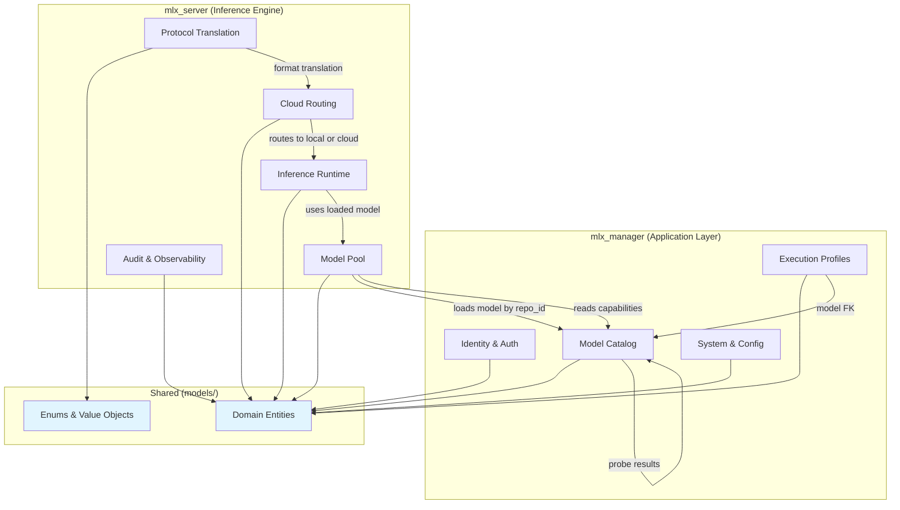
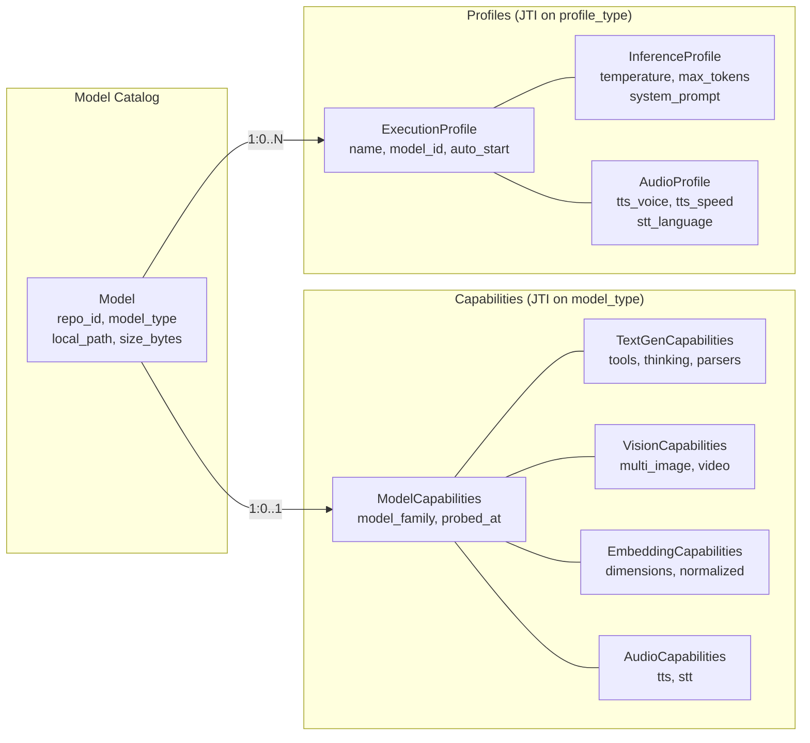
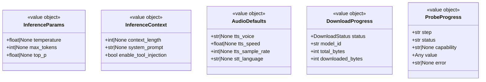
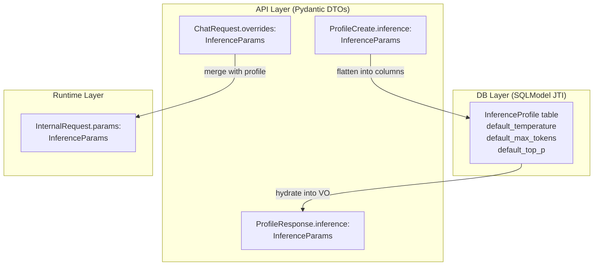
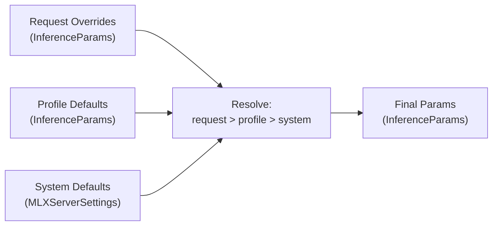
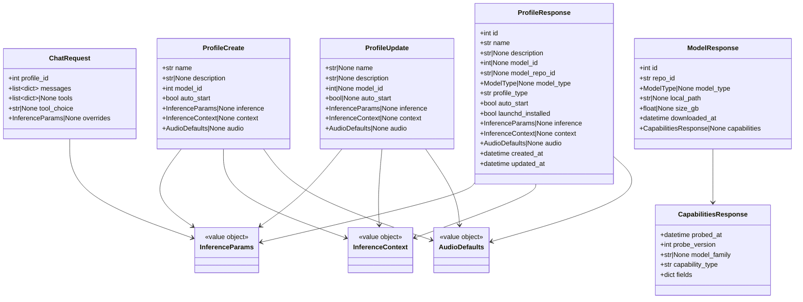
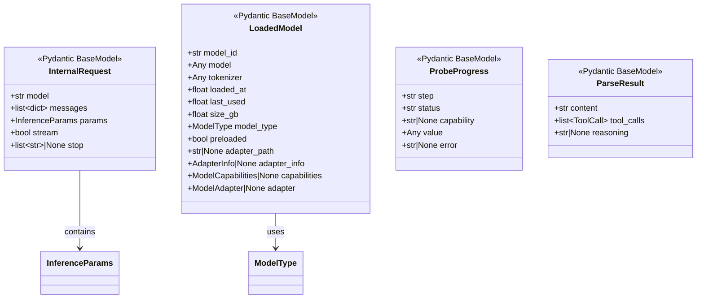

# Data Model Redesign

> **Status**: Approved
> **Date**: 2026-02-12
> **Scope**: Backend data model unification across `mlx_manager` and `mlx_server`

## Table of Contents

1. [Problem Statement](#1-problem-statement)
2. [Design Principles](#2-design-principles)
3. [Bounded Contexts](#3-bounded-contexts)
4. [Domain Entities](#4-domain-entities-sqlmodel-tables)
5. [Shared Value Objects](#5-shared-value-objects-pydantic-basemodel)
6. [API DTOs](#6-api-dtos-requestresponse)
7. [Configuration](#7-configuration-basesettings)
8. [Runtime Models](#8-runtime-models-inference-context)
9. [Deletion Candidates](#9-deletion-candidates)
10. [Migration Strategy](#10-migration-strategy)

---

## 1. Problem Statement

The current data model has grown organically from UI-form-driven storage into a 135+ class sprawl across 20+ files, with:

- **Same concept, 4 implementations**: `HealthStatus` exists as SQLModel, TypedDict, and 2 BaseModels
- **God Object**: `Model` table has 23 nullable fields mixing download metadata with type-specific capabilities
- **Wrong base classes**: 15+ response DTOs inherit SQLModel despite having no DB table
- **Dead code**: 3 TypedDict classes with zero references
- **Semantic confusion**: `max_tokens` on `ServerProfile` is an inference default, not a profile property
- **Circular dependency**: `mlx_server` imports domain entities from `mlx_manager.models`
- **Duplicate definitions**: `ProbeStep`, `ProbeResult`, `ModelInfo`, `BenchmarkResult` each defined twice

### Goal

A clean, DDD-aligned data model where:
- Every class has **one job** and **one canonical location**
- Domain entities (SQLModel) are separate from API DTOs (Pydantic BaseModel)
- Polymorphic inheritance models type-specific concerns cleanly
- Shared value objects enable **composition over duplication**
- The dependency direction is always `mlx_manager` -> `mlx_server`, never reverse

---

## 2. Design Principles

| Principle | Rule |
|-----------|------|
| **Single Source of Truth** | Each concept defined once, imported everywhere |
| **Semantic Ownership** | Fields live where they have domain meaning |
| **Polymorphic over Nullable** | Type-specific fields in type-specific tables, not nullable columns |
| **Composition over Duplication** | Shared field groups as embeddable value objects |
| **Layer Separation** | DB entities, API DTOs, and runtime objects are distinct |
| **Dependency Direction** | Shared models in `mlx_manager.models/`, imported by both layers |
| **Enum Everything** | No raw strings for constrained values |
| **Data Written Once** | Each field has exactly one writer; readers compose via relationships |

---

## 3. Bounded Contexts



---

## 4. Domain Entities (SQLModel Tables)

### 4.1 Polymorphic Architecture Overview

Both `ModelCapabilities` and `ExecutionProfile` use **Joined Table Inheritance (JTI)** with `model_type` as the discriminator. This means:

- A **base table** holds shared fields and a `discriminator` column
- **Subclass tables** hold type-specific fields with a FK back to the base
- SQLAlchemy automatically JOINs and returns the correct Python subclass
- Queries can filter on type-specific columns using standard SQL (no JSON parsing)



### 4.2 Entity Relationship Diagram

```mermaid
erDiagram
    User {
        int id PK
        string email UK
        string hashed_password
        bool is_admin
        UserStatus status
        datetime created_at
        datetime approved_at
        int approved_by FK
    }

    Model {
        int id PK
        string repo_id UK
        ModelType model_type
        string local_path
        int size_bytes
        datetime downloaded_at
        datetime last_used_at
    }

    ModelCapabilities {
        int id PK
        int model_id FK "unique"
        string capability_type "discriminator"
        datetime probed_at
        int probe_version
        string model_family
    }

    TextGenCapabilities {
        int id PK "FK to model_capabilities"
        bool supports_native_tools
        bool supports_thinking
        string tool_format
        int practical_max_tokens
        string tool_parser_id
        string thinking_parser_id
    }

    VisionCapabilities {
        int id PK "FK to model_capabilities"
        bool supports_native_tools
        bool supports_thinking
        bool supports_multi_image
        bool supports_video
        string tool_parser_id
        string thinking_parser_id
    }

    EmbeddingCapabilities {
        int id PK "FK to model_capabilities"
        int embedding_dimensions
        int max_sequence_length
        bool is_normalized
    }

    AudioCapabilities {
        int id PK "FK to model_capabilities"
        bool supports_tts
        bool supports_stt
    }

    ExecutionProfile {
        int id PK
        string name
        string description
        int model_id FK
        string profile_type
        bool auto_start
        bool launchd_installed
        datetime created_at
        datetime updated_at
    }

    InferenceProfile {
        int id PK "FK to execution_profiles"
        int context_length
        string system_prompt
        float default_temperature
        int default_max_tokens
        float default_top_p
        bool enable_tool_injection
    }

    AudioProfile {
        int id PK "FK to execution_profiles"
        string default_tts_voice
        float default_tts_speed
        int default_tts_sample_rate
        string default_stt_language
    }

    Download {
        int id PK
        string model_repo_id
        DownloadStatus status
        int total_bytes
        int downloaded_bytes
        string error
        datetime started_at
        datetime completed_at
    }

    BackendMapping {
        int id PK
        string model_pattern
        PatternType pattern_type
        BackendType backend_type
        string backend_model
        BackendType fallback_backend
        int priority
        bool enabled
    }

    CloudCredential {
        int id PK
        BackendType backend_type UK
        ApiType api_type
        string name
        string encrypted_api_key
        string base_url
    }

    ServerConfig {
        int id PK
        MemoryLimitMode memory_limit_mode
        int memory_limit_value
        EvictionPolicy eviction_policy
        json preload_models
    }

    Setting {
        string key PK
        string value
        datetime updated_at
    }

    AuditLog {
        int id PK
        string request_id
        datetime timestamp
        string model
        BackendType backend_type
        string endpoint
        int duration_ms
        string status
        int prompt_tokens
        int completion_tokens
    }

    Model ||--o| ModelCapabilities : "probed into"
    ModelCapabilities ||--o| TextGenCapabilities : "text-gen"
    ModelCapabilities ||--o| VisionCapabilities : "vision"
    ModelCapabilities ||--o| EmbeddingCapabilities : "embeddings"
    ModelCapabilities ||--o| AudioCapabilities : "audio"
    Model ||--o{ ExecutionProfile : "bound to"
    ExecutionProfile ||--o| InferenceProfile : "text-gen or vision"
    ExecutionProfile ||--o| AudioProfile : "audio"
```



### 4.3 Design Decisions

#### 4.3.1 Model: Clean Catalog Entity

**Before**: 23 fields mixing download metadata, probe timestamps, and type-specific capabilities.
**After**: Only catalog/download metadata. Capabilities live in their own polymorphic hierarchy.

```python
class Model(SQLModel, table=True):
    __tablename__ = "models"

    id: int | None = Field(default=None, primary_key=True)
    repo_id: str = Field(unique=True, index=True)
    model_type: ModelType | None = None     # enum, not str
    local_path: str | None = None
    size_bytes: int | None = None
    downloaded_at: datetime = Field(default_factory=utcnow)
    last_used_at: datetime | None = None

    # Relationships
    capabilities: "ModelCapabilities | None" = Relationship(back_populates="model")
    profiles: list["ExecutionProfile"] = Relationship(back_populates="model")
```

`model_type` uses the `ModelType` enum (not a raw string). It is set during download (via `detect_model_type()`) and is the semantic link that determines which capability subclass and which profile subclass are valid for this model.

#### 4.3.2 ModelCapabilities: Polymorphic via Joined Table Inheritance

The base table holds shared probe metadata. Subclass tables hold type-specific capability fields. SQLAlchemy's `polymorphic_on` / `polymorphic_identity` handles the dispatch automatically.

```python
class ModelCapabilities(SQLModel, table=True):
    """Base: shared probe metadata. Subclasses hold type-specific fields."""
    __tablename__ = "model_capabilities"
    __mapper_args__ = {
        "polymorphic_on": "capability_type",
        "polymorphic_identity": "base",
    }

    id: int | None = Field(default=None, primary_key=True)
    model_id: int = Field(foreign_key="models.id", unique=True, index=True)
    capability_type: str  # discriminator, set by subclass identity
    probed_at: datetime = Field(default_factory=utcnow)
    probe_version: int = 1
    model_family: str | None = None

    # Relationship
    model: "Model" = Relationship(back_populates="capabilities")


class TextGenCapabilities(ModelCapabilities, table=True):
    """Capabilities discovered by probing a text generation model."""
    __tablename__ = "text_gen_capabilities"
    __mapper_args__ = {"polymorphic_identity": ModelType.TEXT_GEN}

    id: int | None = Field(
        default=None,
        sa_column=Column(Integer, ForeignKey("model_capabilities.id"), primary_key=True),
    )
    supports_native_tools: bool = False
    supports_thinking: bool = False
    tool_format: str | None = None
    practical_max_tokens: int | None = None
    tool_parser_id: str | None = None
    thinking_parser_id: str | None = None


class VisionCapabilities(ModelCapabilities, table=True):
    """Capabilities discovered by probing a vision model."""
    __tablename__ = "vision_capabilities"
    __mapper_args__ = {"polymorphic_identity": ModelType.VISION}

    id: int | None = Field(
        default=None,
        sa_column=Column(Integer, ForeignKey("model_capabilities.id"), primary_key=True),
    )
    supports_native_tools: bool = False
    supports_thinking: bool = False
    supports_multi_image: bool = False
    supports_video: bool = False
    tool_parser_id: str | None = None
    thinking_parser_id: str | None = None


class EmbeddingCapabilities(ModelCapabilities, table=True):
    """Capabilities discovered by probing an embedding model."""
    __tablename__ = "embedding_capabilities"
    __mapper_args__ = {"polymorphic_identity": ModelType.EMBEDDINGS}

    id: int | None = Field(
        default=None,
        sa_column=Column(Integer, ForeignKey("model_capabilities.id"), primary_key=True),
    )
    embedding_dimensions: int | None = None
    max_sequence_length: int | None = None
    is_normalized: bool = False


class AudioCapabilities(ModelCapabilities, table=True):
    """Capabilities discovered by probing an audio model."""
    __tablename__ = "audio_capabilities"
    __mapper_args__ = {"polymorphic_identity": ModelType.AUDIO}

    id: int | None = Field(
        default=None,
        sa_column=Column(Integer, ForeignKey("model_capabilities.id"), primary_key=True),
    )
    supports_tts: bool = False
    supports_stt: bool = False
```

**Why JTI over JSON blob**: The Models panel supports searching by capability (e.g., "show all models with tool support"). With JTI, these are standard SQL queries:

```sql
-- Find all text-gen models that support tools
SELECT m.* FROM models m
  JOIN model_capabilities mc ON mc.model_id = m.id
  JOIN text_gen_capabilities tgc ON tgc.id = mc.id
WHERE tgc.supports_native_tools = true;

-- SQLAlchemy equivalent
stmt = (
    select(Model)
    .join(ModelCapabilities)
    .where(TextGenCapabilities.supports_native_tools == True)
)
```

With a JSON column, this would require `json_extract()` functions that vary across databases and lose type safety.

**Why JTI over Single Table Inheritance (STI)**: STI would put all capability columns in one table with nullable fields for type-specific ones - recreating the God Object problem we're solving. JTI keeps each type's columns in its own table with proper NOT NULL constraints.

#### 4.3.3 ExecutionProfile: Why Rename from ServerProfile

"ServerProfile" is a **legacy name** from when the architecture launched a separate `mlx_server` process per profile, each bound to a port. In that world, a "server profile" configured a server.

The embedded architecture changed this fundamentally: there is **one server** with a **shared model pool**. Profiles no longer map to servers - they map to **execution configurations**: a named combination of model selection + inference defaults + context settings. When a user starts a "server" for a profile, they're really loading a model into the pool and applying the profile's defaults to subsequent requests.

The rename to `ExecutionProfile` reflects this semantic truth:
- A profile **configures execution**, not a server
- A profile **selects a model** and provides **default inference parameters**
- Multiple profiles can reference the same model with different defaults
- The profile's `default_temperature`, `default_max_tokens`, etc. are **starting points** that individual requests can override

#### 4.3.4 ExecutionProfile: Polymorphic by Model Type

Different model types need fundamentally different configuration knobs:

| Model Type | What You Configure | Example |
|-----------|-------------------|---------|
| TEXT_GEN | Temperature, max tokens, system prompt, tool injection | "Creative writing profile: temp=1.2, max_tokens=4096" |
| VISION | Same as text (vision models generate text) + potentially image settings | "Vision analysis: temp=0.3, max_tokens=2048" |
| EMBEDDINGS | Just model selection (no tuning knobs) | "Default embedding profile" |
| AUDIO | Voice, speed, sample rate, language | "Narrator profile: voice=af_heart, speed=0.9" |

Putting `tts_default_voice` next to `temperature` in one flat table means:
- Every text profile has meaningless `NULL` audio fields
- Every audio profile has meaningless `NULL` inference fields
- No validation prevents setting `temperature` on an audio profile
- The UI must conditionally show/hide fields with no type-level guidance

JTI solves all of this:

```python
class ExecutionProfile(SQLModel, table=True):
    """Base: profile identity + lifecycle. Subclasses hold type-specific defaults."""
    __tablename__ = "execution_profiles"
    __mapper_args__ = {
        "polymorphic_on": "profile_type",
        "polymorphic_identity": "base",
    }

    id: int | None = Field(default=None, primary_key=True)
    name: str = Field(index=True)
    description: str | None = None
    model_id: int | None = Field(default=None, foreign_key="models.id")
    profile_type: str  # discriminator, set by subclass identity
    auto_start: bool = False
    launchd_installed: bool = False
    created_at: datetime = Field(default_factory=utcnow)
    updated_at: datetime = Field(default_factory=utcnow)

    # Relationships
    model: "Model | None" = Relationship(back_populates="profiles")


class InferenceProfile(ExecutionProfile, table=True):
    """Profile defaults for text generation and vision models."""
    __tablename__ = "inference_profiles"
    __mapper_args__ = {"polymorphic_identity": "inference"}

    id: int | None = Field(
        default=None,
        sa_column=Column(Integer, ForeignKey("execution_profiles.id"), primary_key=True),
    )
    default_context_length: int | None = None
    default_system_prompt: str | None = None
    default_temperature: float | None = Field(default=None, ge=0.0, le=2.0)
    default_max_tokens: int | None = Field(default=None, ge=1, le=128000)
    default_top_p: float | None = Field(default=None, ge=0.0, le=1.0)
    enable_tool_injection: bool = False


class AudioProfile(ExecutionProfile, table=True):
    """Profile defaults for audio (TTS/STT) models."""
    __tablename__ = "audio_profiles"
    __mapper_args__ = {"polymorphic_identity": "audio"}

    id: int | None = Field(
        default=None,
        sa_column=Column(Integer, ForeignKey("execution_profiles.id"), primary_key=True),
    )
    default_tts_voice: str | None = None
    default_tts_speed: float | None = Field(default=None, ge=0.25, le=4.0)
    default_tts_sample_rate: int | None = None
    default_stt_language: str | None = None
```

**Profile type assignment**: When a profile is created, the `profile_type` discriminator is determined by the associated model's `model_type`:

| `Model.model_type` | Profile subclass | `profile_type` value |
|-------------------|-----------------|---------------------|
| `TEXT_GEN` | `InferenceProfile` | `"inference"` |
| `VISION` | `InferenceProfile` | `"inference"` |
| `EMBEDDINGS` | `ExecutionProfile` (base) | `"base"` |
| `AUDIO` | `AudioProfile` | `"audio"` |

Embedding models use the base `ExecutionProfile` directly since they have no tuning parameters beyond model selection. If embedding-specific settings emerge later (e.g., `default_batch_size`), an `EmbeddingProfile` subclass can be added without touching existing tables.

**The `default_` prefix** on inference/audio fields makes it explicit these are defaults that requests can override, not properties of the profile itself.

#### 4.3.5 BackendMapping + CloudCredential (moved to shared models)

These currently live in `mlx_manager/models.py` but are consumed by `mlx_server/services/cloud/router.py`, causing a reverse dependency. Moving them to the shared `models/` package fixes the dependency direction.

---

## 5. Shared Value Objects (Pydantic BaseModel)

These are **reusable field groups** that appear in API DTOs and runtime objects. Define once, compose everywhere. They are NOT SQLModel tables - they are pure Pydantic models used for validation, serialization, and composition.



### 5.1 Definitions

```python
# --- Inference parameters (reused by Profile DTOs, ChatRequest, InternalRequest) ---

class InferenceParams(BaseModel):
    """Generation parameters that can be set at profile or request level."""
    temperature: float | None = None
    max_tokens: int | None = None
    top_p: float | None = None


class InferenceContext(BaseModel):
    """Execution context settings beyond raw generation params."""
    context_length: int | None = None
    system_prompt: str | None = None
    enable_tool_injection: bool = False


class AudioDefaults(BaseModel):
    """Default audio parameters for TTS/STT."""
    tts_voice: str | None = None
    tts_speed: float | None = Field(default=None, ge=0.25, le=4.0)
    tts_sample_rate: int | None = None
    stt_language: str | None = None
```

### 5.2 Relationship Between Value Objects, Domain Entities, and DTOs

Value objects serve as the **lingua franca** between layers. The same `InferenceParams` shape appears in three contexts, but each layer stores/transports it differently:



**DB -> DTO**: When building a `ProfileResponse`, the router reads the `InferenceProfile` columns and hydrates an `InferenceParams` value object:
```python
InferenceParams(
    temperature=profile.default_temperature,
    max_tokens=profile.default_max_tokens,
    top_p=profile.default_top_p,
)
```

**DTO -> DB**: When creating a profile, the router flattens the `InferenceParams` value object into DB columns:
```python
profile.default_temperature = dto.inference.temperature
profile.default_max_tokens = dto.inference.max_tokens
profile.default_top_p = dto.inference.top_p
```

### 5.3 Inference Parameter Resolution Cascade

The same `InferenceParams` value object flows through the resolution cascade at request time:



```python
def resolve_inference_params(
    request: InferenceParams | None,
    profile: InferenceParams,
    system_default_max_tokens: int,
) -> InferenceParams:
    """Request overrides profile, profile overrides system defaults."""
    req = request or InferenceParams()
    return InferenceParams(
        temperature=first_not_none(req.temperature, profile.temperature, 0.7),
        max_tokens=first_not_none(req.max_tokens, profile.max_tokens, system_default_max_tokens),
        top_p=first_not_none(req.top_p, profile.top_p, 1.0),
    )
```

---

## 6. API DTOs (Request/Response)

All API DTOs are **plain Pydantic BaseModel** - never SQLModel. They compose from value objects and add endpoint-specific fields.

### 6.1 DTO Composition Diagram



### 6.2 Key DTO Definitions

```python
# --- Profile DTOs ---

class ProfileCreate(BaseModel):
    """Create an execution profile. The server determines profile_type from the model."""
    name: str
    description: str | None = None
    model_id: int
    auto_start: bool = False
    # Type-specific defaults (server validates against model_type)
    inference: InferenceParams | None = None
    context: InferenceContext | None = None
    audio: AudioDefaults | None = None


class ProfileUpdate(BaseModel):
    """Partial update. Only provided fields are changed."""
    name: str | None = None
    description: str | None = None
    model_id: int | None = None
    auto_start: bool | None = None
    inference: InferenceParams | None = None
    context: InferenceContext | None = None
    audio: AudioDefaults | None = None


class ProfileResponse(BaseModel):
    """Full profile with denormalized model info and type-specific defaults."""
    id: int
    name: str
    description: str | None
    model_id: int | None
    model_repo_id: str | None       # denormalized from Model
    model_type: ModelType | None     # denormalized from Model
    profile_type: str                # "inference", "audio", or "base"
    auto_start: bool
    launchd_installed: bool
    # Type-specific (None for types that don't use them)
    inference: InferenceParams | None
    context: InferenceContext | None
    audio: AudioDefaults | None
    created_at: datetime
    updated_at: datetime
```

**Profile DTO validation**: On `ProfileCreate`, the router looks up the model, determines its `model_type`, and validates that the provided defaults match:
- If `model_type` is TEXT_GEN/VISION and `audio` is provided -> 422 error
- If `model_type` is AUDIO and `inference` is provided -> 422 error
- If `model_type` is EMBEDDINGS and either is provided -> 422 error

```python
# --- Chat DTO ---

class ChatRequest(BaseModel):
    """Chat request via mlx_manager UI. Overrides cascade over profile defaults."""
    profile_id: int
    messages: list[dict[str, Any]]
    tools: list[dict[str, Any]] | None = None
    tool_choice: str | None = None
    overrides: InferenceParams | None = None    # only override what you need


# --- Model DTOs ---

class ModelResponse(BaseModel):
    id: int
    repo_id: str
    model_type: ModelType | None
    local_path: str | None
    size_bytes: int | None
    size_gb: float | None                        # computed from size_bytes
    downloaded_at: datetime
    last_used_at: datetime | None
    capabilities: CapabilitiesResponse | None


class CapabilitiesResponse(BaseModel):
    """Polymorphic capabilities response. `fields` contains the type-specific data."""
    probed_at: datetime
    probe_version: int
    model_family: str | None
    capability_type: str              # "text-gen", "vision", "embeddings", "audio"
    fields: dict[str, Any]            # type-specific fields as dict
```

The `CapabilitiesResponse.fields` dict contains the subclass-specific fields. This keeps the response shape simple while preserving all data. The frontend already has type-specific interfaces (`TextGenCapabilities`, `VisionCapabilities`, etc.) to interpret the `fields` based on `capability_type`.

### 6.3 Comparison: Before vs After

| Before (current) | After (proposed) | Change |
|---|---|---|
| `ServerProfileBase(SQLModel)` with 15 flat fields | `ProfileCreate(BaseModel)` with nested VOs | Semantic grouping + polymorphism |
| `ServerProfileCreate/Update/Response(SQLModel)` | `ProfileCreate/Update/Response(BaseModel)` | Correct base class |
| `ChatRequest.temperature/max_tokens/top_p` | `ChatRequest.overrides: InferenceParams` | Composition, no duplication |
| `ModelResponse(SQLModel)` 23 flat fields | `ModelResponse(BaseModel)` + `CapabilitiesResponse` | Separation of concerns |
| `RunningServerResponse(SQLModel)` | `RunningServerResponse(BaseModel)` | Correct base class |
| `HealthStatus(SQLModel)` | `HealthStatus(BaseModel)` | Correct base class |
| `SystemMemory/SystemInfo/LaunchdStatus(SQLModel)` | Same names but `(BaseModel)` | Correct base class |
| 4 different health status classes | 1 `HealthStatus(BaseModel)` | Single source of truth |

---

## 7. Configuration (BaseSettings)

Two settings classes remain, but with deduplication:

```python
# mlx_manager/config.py
class Settings(BaseSettings):
    """Application-level settings (env: MLX_MANAGER_*)."""
    model_config = SettingsConfigDict(env_prefix="MLX_MANAGER_")

    # Auth
    jwt_secret: str = Field(default_factory=generate_secret)
    jwt_algorithm: str = "HS256"
    jwt_expire_days: int = 30

    # Paths
    database_path: Path = Path("~/.mlx-manager/mlx-manager.db")
    hf_cache_path: Path = Path(HF_HOME)

    # Server
    host: str = "127.0.0.1"
    port: int = 10242
    debug: bool = False

    # HuggingFace
    hf_organization: str | None = None
    offline_mode: bool = False

    # Defaults
    default_port_start: int = 10240
    health_check_interval: int = 30
    allowed_model_dirs: list[str] = []


# mlx_server/config.py
class MLXServerSettings(BaseSettings):
    """Inference engine settings (env: MLX_SERVER_*)."""
    model_config = SettingsConfigDict(env_prefix="MLX_SERVER_")

    embedded_mode: bool = True

    # Pool
    max_memory_gb: float = 0.0
    max_models: int = 3
    max_cache_size_gb: float = 0.0
    default_max_tokens: int = 4096           # system default for inference

    # Timeouts
    timeout_chat_seconds: float = 120.0
    timeout_completions_seconds: float = 120.0
    timeout_embeddings_seconds: float = 60.0

    # Observability
    logfire_enabled: bool = False
    logfire_token: str | None = None
    audit_retention_days: int = 30

    # Cloud
    enable_cloud_routing: bool = False

    # Batching
    enable_batching: bool = False
    batch_block_pool_size: int = 256
    batch_max_batch_size: int = 8

    # Runtime
    environment: str = "production"
    database_path: str = ""                 # set from Settings.database_path
```

**Changes**: Removed `host`, `port`, `available_models`, `default_model` from `MLXServerSettings` (these are set programmatically in embedded mode, not via env vars). Removed duplicate `database_path` concept by having it explicitly set from `Settings.database_path` at startup.

---

## 8. Runtime Models (Inference Context)

These are **in-process objects** that exist only during inference. They should be Pydantic BaseModel for validation and serialization, not dataclasses.

### 8.1 Current Dataclasses -> Pydantic



**Key change**: `InternalRequest` now embeds `InferenceParams` instead of duplicating `temperature`/`max_tokens`/`top_p` as separate fields:

```python
class InternalRequest(BaseModel):
    """Protocol-agnostic inference request (lingua franca between protocols)."""
    model: str
    messages: list[dict[str, Any]]
    params: InferenceParams
    stream: bool = False
    stop: list[str] | None = None
```

### 8.2 Protocol Schemas (OpenAI / Anthropic)

The OpenAI and Anthropic schemas in `mlx_server/schemas/` stay as-is. They are **external protocol contracts** that must match the respective API specs exactly. They are NOT domain models - they are serialization/deserialization boundaries.

The `Usage` class existing in both `openai.py` and `anthropic.py` with different field names (`prompt_tokens`/`completion_tokens` vs `input_tokens`/`output_tokens`) is **correct** - these are protocol-specific response shapes.

---

## 9. Deletion Candidates

### 9.1 Dead Code (delete immediately)

| Class | File | Reason |
|-------|------|--------|
| `HealthCheckResult` | `types.py:5` | Zero references |
| `ServerStats` | `types.py:15` | Zero references |
| `RunningServerInfo` | `types.py:26` | Zero references |

### 9.2 Duplicate Definitions (merge into one)

| Keep | Delete | Reason |
|------|--------|--------|
| `probe/steps.py:ProbeStep` | `model_probe.py:ProbeStep` | Old probe duplicate |
| `probe/steps.py:ProbeResult` | `model_probe.py:ProbeResult` | Old probe duplicate |
| `ModelResponse` (new BaseModel) | `ModelSearchResult` (types.py TypedDict) | SQLModel version in models.py replaces TypedDict |
| `LaunchdStatus` (new BaseModel) | `LaunchdStatus` (types.py TypedDict) | Same name, slightly different fields |

### 9.3 Replaced by Composition / Polymorphism

| Before | After | Reason |
|--------|-------|--------|
| `ServerProfileBase(SQLModel)` | Eliminated | JTI replaces flat inheritance |
| `ServerProfile(SQLModel, table=True)` | `ExecutionProfile` + `InferenceProfile` / `AudioProfile` | Polymorphic split |
| `Model.supports_*` (23 nullable fields) | `TextGenCapabilities` / `VisionCapabilities` / etc. | Polymorphic split |
| `ProfileServerStatus(BaseModel)` | Merged into `ServerStatus(BaseModel)` | Semantic duplicate |
| `ProfileHealthStatus(BaseModel)` | Merged into `HealthStatus(BaseModel)` | Semantic duplicate |
| `RunningServer(BaseModel)` | Merged into `RunningServerResponse(BaseModel)` | Semantic duplicate |
| `ServerHealthStatus(BaseModel)` | Merged into `HealthStatus(BaseModel)` | Semantic duplicate |

### 9.4 TypedDicts to Convert

| TypedDict | Replacement | Used By |
|-----------|------------|---------|
| `DownloadStatus` | `DownloadProgress(BaseModel)` | `hf_client.py` SSE streaming |
| `LocalModelInfo` | `LocalModel(BaseModel)` (already exists) | `hf_client.py` |
| `ModelSearchResult` | `ModelSearchResult(BaseModel)` | `hf_client.py` |
| `ModelCharacteristics` | `ModelCharacteristics(BaseModel)` | `model_detection.py` |

### 9.5 Net Effect

| Category | Before | After | Delta |
|----------|-------:|------:|------:|
| SQLModel tables | 10 | 14 | +4 (JTI subclass tables) |
| SQLModel non-table (response DTOs) | 32 | **0** | -32 |
| Pydantic BaseModel (DTOs) | 58 | ~45 | -13 |
| Pydantic BaseModel (value objects) | 0 | ~6 | +6 |
| BaseSettings | 2 | 2 | 0 |
| Dataclasses | 19 | ~8 | -11 |
| TypedDict | 8 | **0** | -8 |
| **Total** | **~135** | **~75** | **-60** |

The +4 tables from JTI are worth it: they replace 23 nullable columns with properly typed, queryable, validated fields in dedicated tables.

---

## 10. Migration Strategy

### 10.1 File Layout (Target)

```
backend/mlx_manager/
    models/
        __init__.py              # re-exports for backward compat
        enums.py                 # all enums (ModelType, UserStatus, BackendType, ...)
        domain.py                # SQLModel table entities (Model, User, Setting, etc.)
        capabilities.py          # ModelCapabilities + JTI subclasses
        profiles.py              # ExecutionProfile + JTI subclasses
        value_objects.py         # InferenceParams, AudioDefaults, etc.
        dto/
            __init__.py
            auth.py              # UserCreate, UserPublic, Token, ...
            profiles.py          # ProfileCreate, ProfileUpdate, ProfileResponse
            models.py            # ModelResponse, CapabilitiesResponse, ...
            servers.py           # RunningServerResponse, HealthStatus, ...
            settings.py          # BackendMappingCreate, CloudCredentialCreate, ...
            system.py            # SystemInfo, SystemMemory, ...

    mlx_server/
        schemas/
            openai.py            # unchanged (external protocol)
            anthropic.py         # unchanged (external protocol)
        models/
            pool.py              # LoadedModel (Pydantic BaseModel)
            types.py             # re-exports ModelType from models/enums.py
            audit.py             # AuditLog entity + DTOs
        services/
            protocol.py          # InternalRequest (uses InferenceParams)
            ...
```

### 10.2 Phased Migration

**Phase 1 - Cleanup (no behavior change)**
- Delete dead TypedDicts (3 classes)
- Delete duplicate `ProbeStep`/`ProbeResult` in `model_probe.py`
- Change non-table SQLModel response classes to BaseModel
- Merge duplicate health/server status classes

**Phase 2 - Foundation**
- Create `models/enums.py` - consolidate all enums
- Create `models/value_objects.py` with `InferenceParams`, `AudioDefaults`, etc.
- Update `InternalRequest` to use `InferenceParams`

**Phase 3 - Capability Polymorphism**
- Create `models/capabilities.py` with JTI hierarchy
- Split `Model` table: move capability fields to `ModelCapabilities` + subclasses
- DB migration: extract capability data from `Model` into new tables
- Update probe service to write to new tables
- Update pool to read from new relationship

**Phase 4 - Profile Polymorphism**
- Create `models/profiles.py` with JTI hierarchy
- Rename `ServerProfile` -> `ExecutionProfile` + subclasses
- DB migration: extract profile-specific fields into new tables
- Update routers to use polymorphic profiles

**Phase 5 - DTO Migration**
- Create `models/dto/` package
- Migrate all response/request models to plain BaseModel with value object composition
- Update routers to use new DTOs
- Update frontend types to match new nested structure

**Phase 6 - Runtime Model Cleanup**
- Convert remaining dataclasses to Pydantic BaseModel
- Eliminate `types.py` (TypedDict file)
- Move `BackendMapping`/`CloudCredential` to shared models

### 10.3 DB Migration

Each phase that changes the schema includes an Alembic migration:

```
Phase 3: create model_capabilities, text_gen_capabilities, vision_capabilities,
         embedding_capabilities, audio_capabilities tables.
         Migrate data from models.supports_* columns.
         Drop old columns from models table.

Phase 4: create execution_profiles, inference_profiles, audio_profiles tables.
         Migrate data from server_profiles table.
         Drop old server_profiles table.
```

### 10.4 Backward Compatibility

During migration, `models/__init__.py` re-exports everything under old names:

```python
# models/__init__.py - temporary backward compat
from .domain import Model, ExecutionProfile as ServerProfile, ...
from .dto.profiles import ProfileCreate as ServerProfileCreate, ...
```

This allows incremental migration without breaking all imports at once. Remove re-exports once all consumers are updated.

---

## Appendix: Enum Consolidation

All enums in one file (`models/enums.py`):

```python
class ModelType(StrEnum):
    TEXT_GEN = "text-gen"
    VISION = "vision"
    EMBEDDINGS = "embeddings"
    AUDIO = "audio"

class UserStatus(StrEnum):
    PENDING = "pending"
    APPROVED = "approved"
    DISABLED = "disabled"

class BackendType(StrEnum):
    LOCAL = "local"
    OPENAI = "openai"
    ANTHROPIC = "anthropic"
    OPENAI_COMPATIBLE = "openai-compatible"
    ANTHROPIC_COMPATIBLE = "anthropic-compatible"
    TOGETHER = "together"
    GROQ = "groq"
    FIREWORKS = "fireworks"
    MISTRAL = "mistral"
    DEEPSEEK = "deepseek"

class ApiType(StrEnum):
    OPENAI = "openai"
    ANTHROPIC = "anthropic"

class PatternType(StrEnum):
    EXACT = "exact"
    PREFIX = "prefix"
    REGEX = "regex"

class MemoryLimitMode(StrEnum):
    PERCENT = "percent"
    GB = "gb"

class EvictionPolicy(StrEnum):
    LRU = "lru"
    LFU = "lfu"
    TTL = "ttl"

class DownloadStatus(StrEnum):
    PENDING = "pending"
    STARTING = "starting"
    DOWNLOADING = "downloading"
    PAUSED = "paused"
    COMPLETED = "completed"
    FAILED = "failed"
    CANCELLED = "cancelled"

class ProfileType(StrEnum):
    BASE = "base"           # embeddings (no extra config)
    INFERENCE = "inference"  # text-gen, vision
    AUDIO = "audio"          # tts/stt
```

Currently `pattern_type`, `memory_limit_mode`, `eviction_policy`, download `status`, and profile type are all raw strings. Making them enums adds validation and discoverability.
